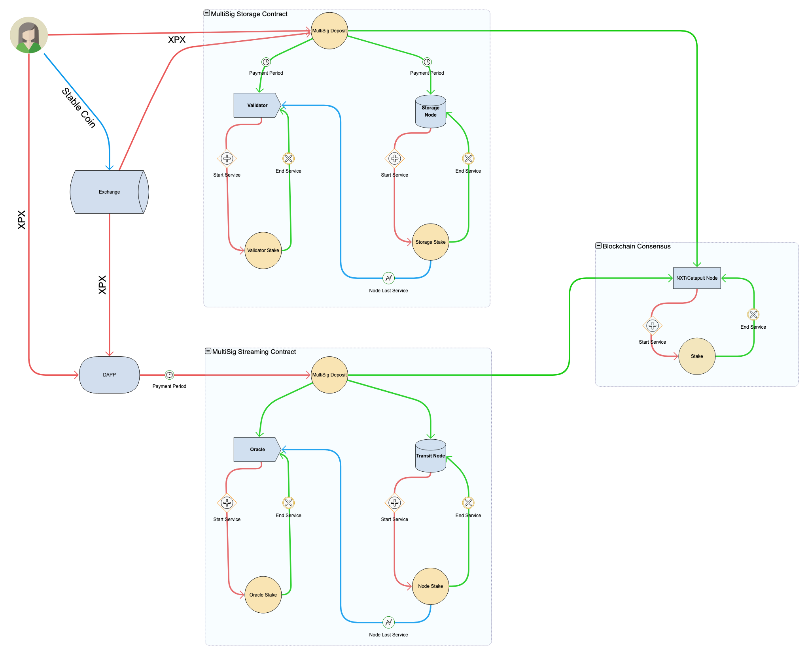
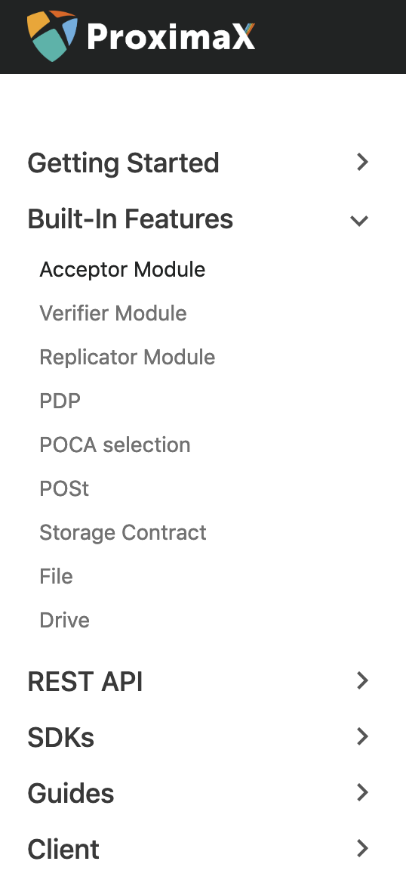

## Core Development

The team has been pushing hard on progressing development to ensure we achieve our goals for the year. There has been a lot of internal discussions on design approach, proper use of patterns, changes to signature schemes, and research.  These have all helped further enhance our platform.  

### Blockchain – merged with NEM Cow
NEM Tech (built by Tech Bureau Corporation) continuously upgrades their server code and the Cow update has been a great addition to our source base. The most important aspects of the Cow update for us are the fee calculation strategy and the different signature schemes. The fee calculation strategy will be validated against our own token economy design and merged accordingly to our incentivisation mechanism.

Token Economy High-Level Diagram with XPX and Stablecoin.

### Storage / DFMS
Our major focus for February has been on refactoring the current Storage Platform. We have researchers and auditors that are continuously improving our code and implementations, validating the results of major changes to our core patterns and conventions. With this new structure in place, it will be easier for us to extend and make modifications to the storage platform which can also be used by public contributors once we go live (public).

We have put great emphasis on the drive/directory functions. This feature will basically allow clients to rent some pre-defined amount of space, which you can use to store multiple files and folders, regardless of their quantity and structure. The only restriction is drive size, but you can avoid this limitation by using multiple drives.
  
We also started working on our Storage Technical Documentation that we will share with the community. This will have all the technical specifications and how-to guides, which include those for our REST API and SDKs. Public DFMS will have its own set of SDKs, starting with the DFMS GO SDK as a reference implementation. This will be the main SDK that clients/DAapps will use to communicate with the storage layer and it will also be used as a thin client participant on the storage network. 

## File Storage Vesting/Staking Paper
We are finalising the file storage staking paper. This paper will outline the staking mechanism that will be deployed to ensure fair economic incentives. We are adding these new updates to the high-level design documentation.

In a nutshell, file storage staking will be based on a dynamic staking scheme. This scheme is a more economically fair form of staking where it relies on the local demand for storage. It is the action of putting up a balance of XPX tokens as a security deposit for the right to participate as a storage node.  The purpose of stake vesting is to incentivise storage node participants to provide the best possible quality of service for platform users.  This research paper reports on the benefits of implementing file storage stake vesting, and considers what permutation of it would be most effective.

We will provide more information on this in the paper which will be publish soon.

## Test Network Early Access Program
By late March to early April, we will launch an early access program for developers who want to try out our test network. We will be inviting a few 1st to 2nd degree connections, as well as enterprises that want to try and build applications on top of our test network platform.

As of now, we are creating a structured flow to the early access program. We are now pushing to clean up all access, SDKs, and support systems to handle this initiative. 

## ProximaX Web Wallet Update
We made further modifications to the web wallet which anyone can now access. 

Updates include: 

1. Support for the creation and modification of mosaics.
2. Support for the creation and modification of namespace.
3. Optimization of the transaction dashboard.
4. A fix for slowness when displaying transactions.
5. Transaction detail type added.
6. Register for namespace.
7. Mosaic supply change.
8. Mosaic definition.
9. Temporary storage of mosaics and namespace in cache per session.
10. Change of wallet UI.
11. Mosaic selection added to transfer module.

You can access the test network web wallet via the link below:

http://bctestnetwallet.xpxsirius.io

We are continuously updating our web wallet to make it on par with our blockchain changes. We will soon have a storage and streaming based application which will complement our storage and streaming layers.

## ProximaX Explorer - Further optimised
We redesigned and rebuilt the explorer to use VueJs. This has improved the performance of the explorer and trimmed the size of the distribution significantly. These improvements were made to ensure that our clients have an intuitive way of accessing the blockchain explorer data. 

We will be bundling this explorer with all our private/permissioned offerings moving forward.

You can access the test network explorer via the link below: 

http://bctestnetexplorer.xpxsirius.io/

## Things we are working on
### Identity System Proof of Concept (PoC)
We have started to work on an Identity System PoC. This is a generic/abstract solution that can be extended via an SDK in order for clients/customers to make validation processes via their app or device (embedded).

The Identity system PoC has 4 layers: Near-field communication (NFC), Front-end, Backend, and the ProximaX Sirius Platform. It features registration, data embedded on NFC and stored on ProximaX Sirius platform, data validation offline via SDK, and a customisable form to enable extensions.

A live demo showcasing this application will be released soon.

### Workflow Engine
We are also working on a workflow engine backed by the ProximaX Sirius platform as a storage of immutable process flow states. This is an extremely powerful application that will enable businesses to build highly customisable flows that take advantage of ProximaX’s built-in predefined contracts/plugins. 

## Summary
Below is a summary of the progress made in February:

* NEM Cow update merged with ProximaX Sirius Platform.
* Further development of Storage/Streaming layer tech and commencement of token economy models integration.
* File Storage Vesting simulation and research.
* Introduction to Test Network Early Access Program Initiative.
* Identity System PoC and Workflow Engine.