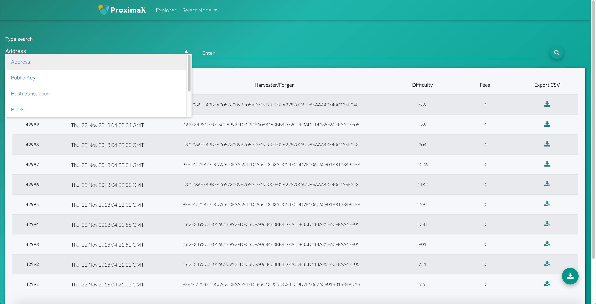
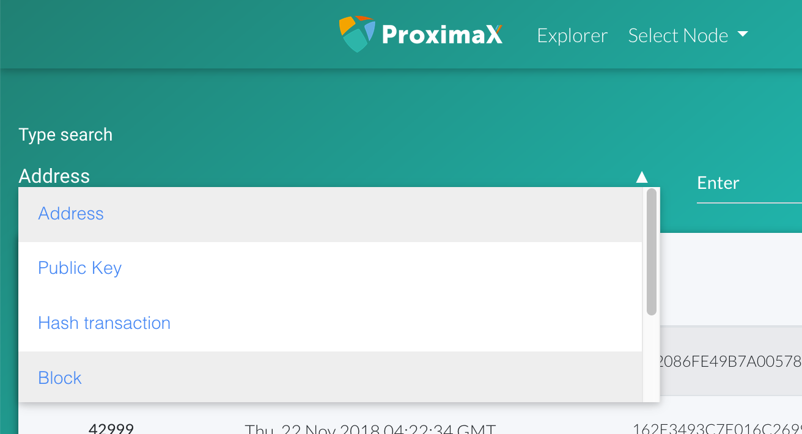
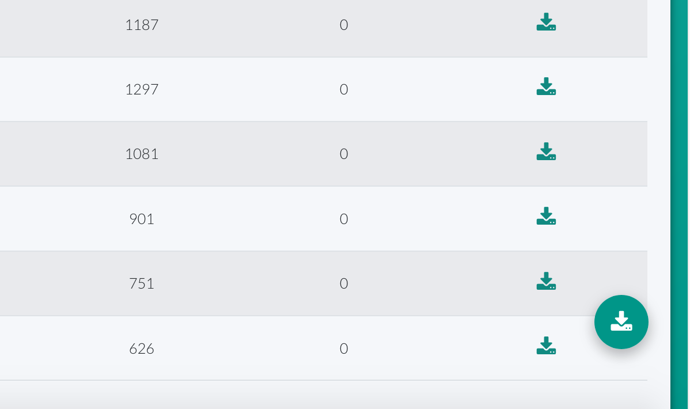
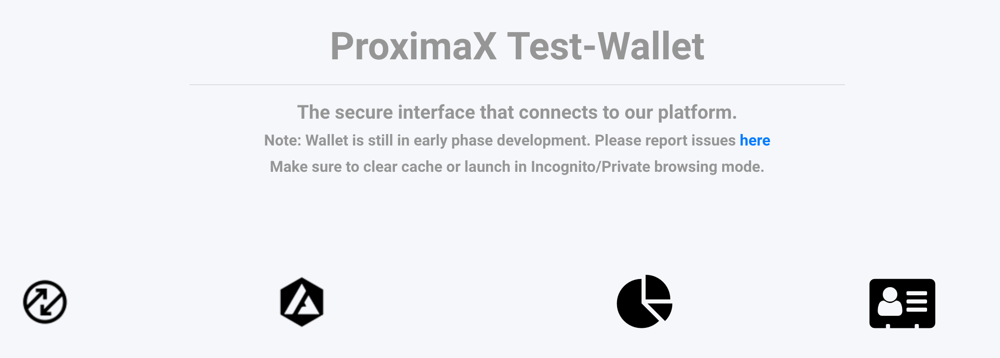
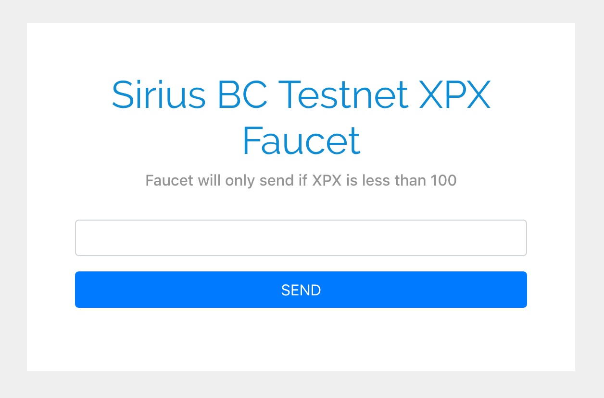

## Blockchain Test Network Explorer
In addition to the endpoints, we have today deployed the blockchain explorer. The blockchain explorer is currently a simple version and we will continue to build and pad more features and functions to it.

http://bctestnetexplorer.xpxsirius.io

This current version of the explorer features a simple search by address, hash, block, and public key. 

### Search
The explorer supports several search keys or filtering allowing anyone to look up addresses, hash, blocks, mosaics, or namespaces.

### Export
Each set of records can be exported into a CSV file.

### Further improvements to the explorer
In order to improve the explorer and user-experience, we encourage the community to test our explorer and provide us with positive feedback.

## Simple Wallet / XPX Faucet
In addition to the explorer, we have also released a version of the ProximaX web wallet. This wallet is still in its early phase of development. However, it has some useful features that can be used to test out the ProximaX testnet.

http://bctestnetwallet.xpxsirius.io

### Features
The wallet has a simple transfer function to allow users to make XPX transactions. The wallet has an address book function, a basic apostille, and a voting module that are referenced from NEM's NanoWallet. 

### More features to come
We will be introducing more features in the following weeks, including new transaction type support, and file manager/explorer using DFMS.

The development team will continue to improve the wallet as we progress. Again, we encourage the community to participate by providing us with postive feedback.

## Faucet
We have also deployed a simple faucet application so that users can acquire their testnet XPX. The faucet will give 100 XPX for each request. 

http://bctestnetfaucet.xpxsirius.io

## Development and Community Engagement
These applications are still early in development and we would like active engagement from the community to test, break, hack and give feeback. It is through this exercise that we hope to be able to improve ourselves.

Log your issues/feedback on our trello board at https://trello.com/invite/b/nVu5ZxqN/e5dad0a439548aa226a61b2c14c5eebb/proximaxtestnetapps

Let us all work together towards a great solution as we progress to the mainnet launch!
