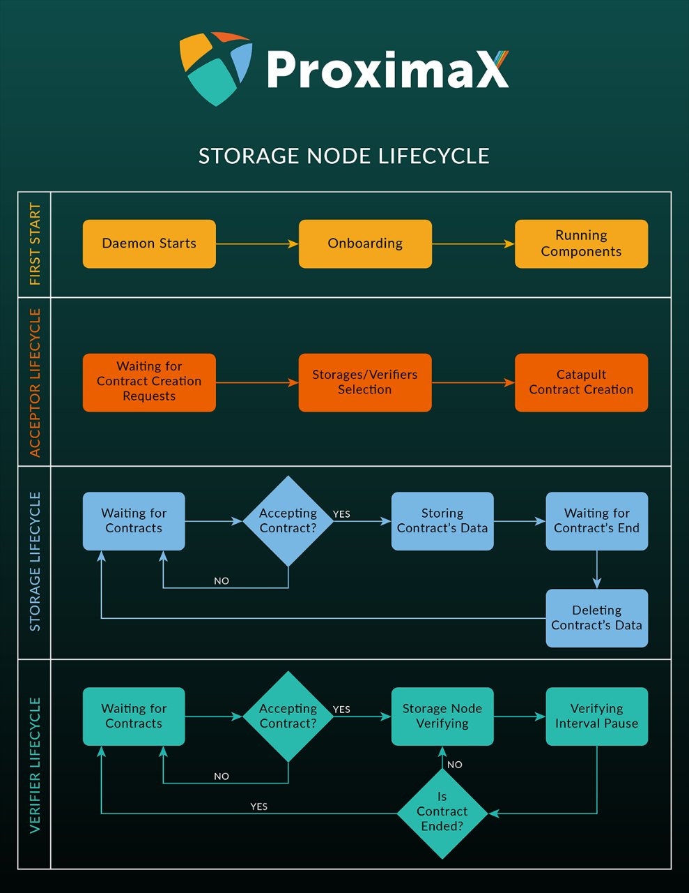

One of the main subsystems on the ProximaX Sirius platform is storage. This article describes a key concept of the Proximax Sirius platform which is the storage lifecycle. The specific actors of this storage lifecycle are the host, verifiers, and replicators. All nodes/actors go through a defined lifecycle as shown in the diagram below. 

**Storage Node Onboarding**

In order for a user to utilize this service, there are several steps that must be taken.

A storage contributor needs to run a cli that will then evaluate the storage and disk space. Information will be collected and sent to the network for verification. The closest verifier then challenges the node to prove that it does have the amount of space. Protocol is based on puzzle over hard to pebble graphs. Once verified, the node will then use a storage mosaic asset which will be registered on the POCA-Market selection.

**Processing client requests**

Following node verification, the node will publish its price per GB or as determined by the network. This node is then registered as a participant in the market. As a participant, it will have a reputation score based on a few factors, namely, stakes held, storage availability, bandwidth, competitive pricing and reported verifier stats.

**Ending of the node lifecycle.**

When a node goes offline, it will relinquish its role to another node in the network. When this other node takes over, the contract will continue from where it has been left off.
