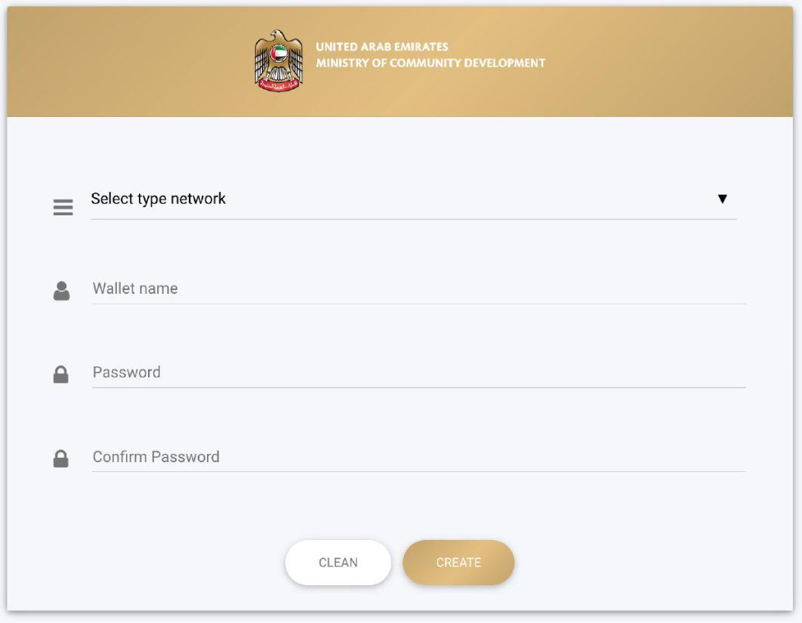

## *ProximaX deploys the ProximaX Sirius platform for MOCD within 2 weeks.*

The Ministry of Community Development of the United Arab Emirates announced today that they have rolled out a Proof of Concept – PoC, powered by the ProximaX Sirius blockchain platform solution.

ProximaX and NEM Foundation jointly worked on the solution, where ProximaX provided its Sirius platform, integrated the Apostille, and completed the voting module for MOCD. The ProximaX Sirius platform consists of a Distributed File Management System, a work collaboration module, and an enterprise version of the NEM Catapult private chain solution.

The deployment of the platform has now enabled MOCD to continue to add in more applications as they start to implement their blockchain initiatives. The platform can further be enhanced by adding more components into the Sirius platform, such as streaming and messaging, decentralised database, and permissioning solutions.

*Apostille Notarization for MOCD*

According to Mr. Saeed Abdulla, Minister's Advisor at MOCD, “We are impressed with how the POC was completed in 2 weeks, and we are excited that with this POC we can continue to develop and deploy solutions on the ProximaX Sirius platform. In the following months, we shall be looking at how we can improve and add more modules and applications into this platform solution. With this POC we hope to be able to achieve our vision of becoming a blockchain-enabled government by the year 2021.”

*Lon Wong, Saeed Abdulla, and Stephen Chia at GITEX in Dubai recently*

The Sirius platform is also service ready for cross-ministry or department integration, allowing other blockchain solutions to integrate with the platform through a permission-based API access.

"The solution is designed for easy deployment and hence we completed this PoC deployment within 2 weeks. It is indeed a world-class production-quality enterprise solution." - Lon Wong, CEO, ProximaX.

Lon adds that this is a very powerful solution because it has most of the fundamental elements of an enterprise class platform to deploy any solution using blockchain as an underlying immutable transaction record. Coupled with other components in the system, it also allows for data transaction. All data are encrypted by default, giving rise to a highly secure information and data record, and store.

*Wallet page*

"The Memorandum of Understanding with MOCD is a demonstration of how the NEM.io foundation charter is instrumental in bringing ecosystem players together to provide the best of breed solution for the client. ProximaX has proven how easy it is to implement the NEM Catapult solution and moving forward from here, we should see more Catapult adoption in industries.” – Stephen Chia, Council Member of NEM.io Foundation and Head of SEA Operations.

ProximaX, through the NEM foundation will commit and continue to support the MOCD into full deployment eventually. It is hoped that this solution will be utilised by other ministries and departments.
