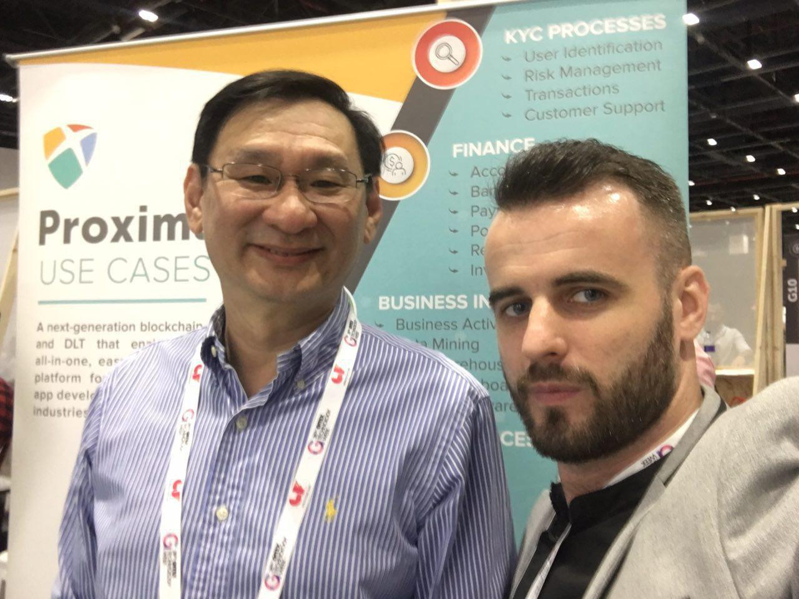

###**SINGAPORE and UKRAINE / 17 October 2018** -  ProximaX, Ltd. today signed a Memorandum of Understanding with 482.solutions, a top-calibre provider of research and development – R&D services in blockchain technology and crypto-economy.482.solutions has deep technical expertise in the development of crypto-economic platforms, distributed protocols and applications (DApps) for businesses  and governments, and has active projects in IoT and robonomics.

Both organizations have an ongoing working arrangement from earlier this year, and with this MOU, they are now formalizing the relationship and will undertake joint research and development activities to establish new use-cases and develop projects on the ProximaX platform utilizing 482.solutions’ technical innovations, and specifically in the areas of IoT and Robotics.

According to Alexander Ivanov, Chief R&D Officer of 482.solutions, “ProximaX is a next-generation blockchain project whose API-driven architecture as well as storage and streaming layers make it a superior blockchain for developers. Our team of developers have both the breadth of experience and depth of knowledge to build new and innovative solutions on this platform and we are very excited about it.”

CEO of 482.solutions, Roman Kravchenko added, “IoT and robotics are one of many key technologies that is set to transform and move society to the Industry 4.0 paradigm. The 482.solutions partnership with ProximaX is an important step for our company that will enable us to turn challenges of Industry 4.0 into business opportunities.”

**Lon Wong and 482.solution's Chief Marketing Officer, Vladimir Malakchi caught up in GITEX, Dubai last week**

The synergy of expertise between 482.solutions and ProximaX in blockchain technology will contribute to next-generation solutions, in which the main actors are “things” - devices, robots etc. The emergence of such systems will thus allow society to focus on value-added activities related to creativity and entrepreneurship. This will be the driving force behind the evolution of economic and social systems globally.

To further champion real world adoption of blockchain technology, both parties have agreed to collaborate on activities to educate enterprises, governments, organizations and the public at large on the use of the ProximaX platform. 

“We believe that 482.solutions, with its expansive knowledge and experience especially in the area of decentralized technology, will be an ideal partner to research and develop projects in the highly coveted areas of IoT and Robotics,”said Alvin Reyes, Co-founder and Chief Technology Officer of ProximaX, “I look forward to building innovative world-class products that will impact and change the world of technology as we know it today.”*

“This collaboration is a milestone partnership, whereby more and more sectors of industries are beginning to see the superior benefit that ProximaX can bring as a blockchain powered platform solution,” said Lon Wong, Founder and CEO of ProximaX.

This close cooperation between the parties will also see 482.solutions becoming the preferred integration partner for ProximaX in the Commonwealth of Independent States – CIS and Eastern Europe, expanding adoption and integration of the ProximaX blockchain solution that provides decentralized storage, messaging, streaming, content delivery, decentralized document proofing and a host of other services. In turn, ProximaX will refer prospective adopters in this region to 482.solutions for consulting and integration services.

For more information visit: https://482.solutions and https://proximax.io/