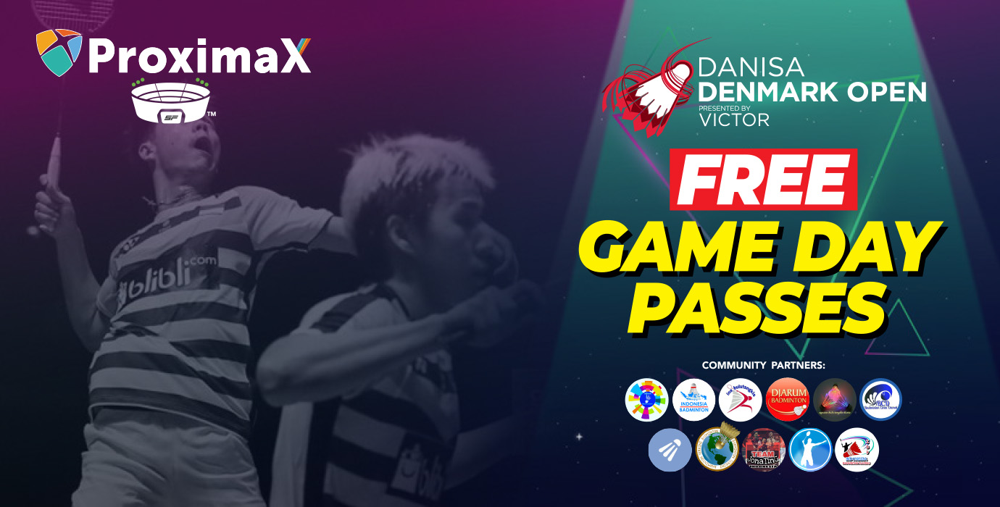
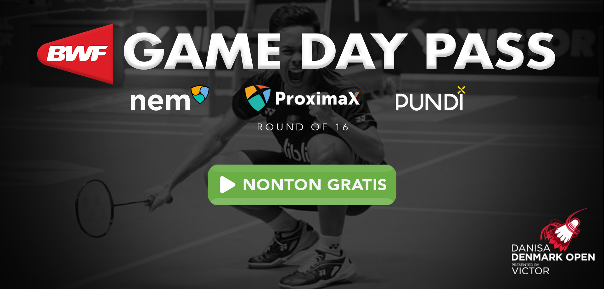
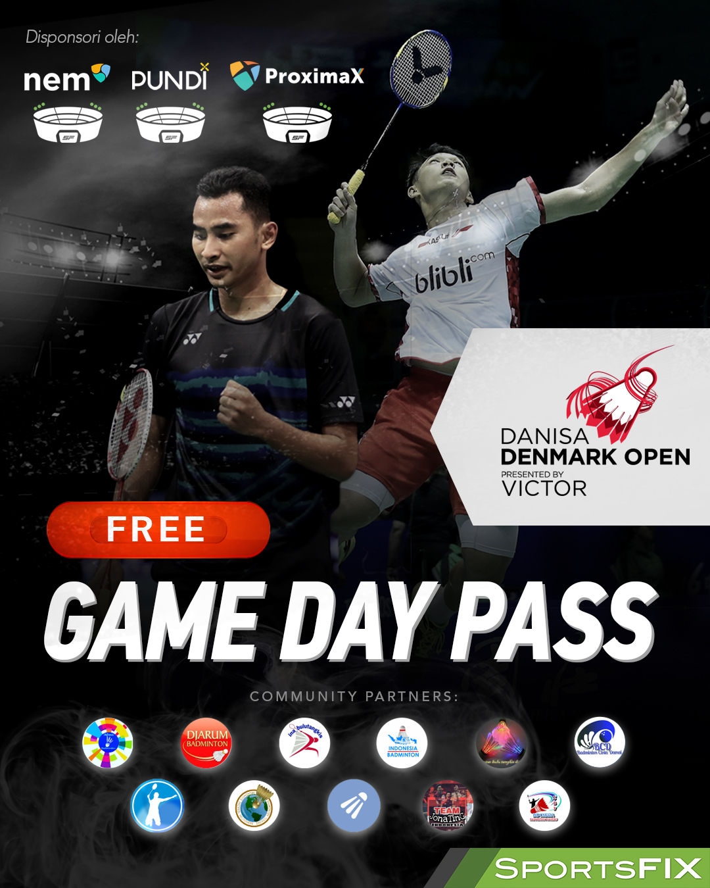

Once again, we are proud sponsors of Sportsfix's Digital Stadium, this time providing FREE game day passes for the HSBC BWF World Tour Super 750 DANISA Denmark Open that takes place from October 18th to 21st. Joined by NEM and PundiX, we have together formed a digital stadium "takeover" for this exciting badminton tournament.

Sportsfix, an innovative next-generation live streaming sports OTT platform is in discussion with our team to use the ProximaX KYC and private blockchain solution to assist in their ICO and power their project respectively. More news about this soon!

Full press release:

#**PROXIMAX, NEM AND PUNDIX JOIN GROWING LIST OF SPORTSFIX SPONSOR PARTNERS!**

*NEM family blockchain to sponsor Game Day Passes of SportsFix Digital StadiumTM*

Kuala Lumpur, Malaysia – SportsFix, a leading OTT platform in Asia announced new partnerships with NEM, Pundi X, and ProximaX to sponsor Game Day Passes for the HSBC BWF World Tour Super 750 DANISA Denmark Open from Oct. 18 to 21 in SportsFix Digital StadiumTM. 

After ProximaX’s successful implementation of Game Day Passes during the HSBC BWF World Tour Super 500 tournament Victor Korea Open last weekend, additional blockchain companies of the NEM family, including NEM itself, are joining in as exclusive sponsors of SportsFix’ Digital StadiumTM. 

SportsFix CEO Carl Kirchhoff welcomes the partnership: *“We are excited about this new partnership and the opportunity to grow our existing fan base by extending our live streaming of premium sports content to the largest crypto community in South East Asia. Having NEM, Pundi X and ProximaX joining as partners is another testament of the quality of our amazing team delivering our SportsFix beta platform to the highest standards and in record time.”*

The DANISA Denmark Open is part of Badminton World Federation (BWF) presenting some of Indonesia’s best players including Asian Games champion Jonatan Christie, Top 10 Men’s Singles player Anthony Sinisuka Ginting, and World Tour No.1 Tommy Sugiarto.

NEM is a smart contract-ready platform. One of the world’s largest blockchains with more than 20 projects on its network today NEM provides a unique consensus algorithm for their users, making smaller wallets to have a significant influence on NEM blockchain than their larger counterparts.

Lance Cheang, NEM Southeast Asia Project Director stated, “We're delighted to be able to sponsor the DANISA Denmark Open 2018 on Sportsfix’s platform. With this partnership, we are looking to increase our exposure in the region to learn more about NEM and its projects.”

Built by key Executives of the NEM project, ProximaX is a consensus algorithm-based platform, enabling an all-in-one platform of secured decentralized storage and distribution of content for multi-industry applications. ProximaX will work closely with SportsFix to advance Digital Stadium features utilizing their existing technology and services.

Lon Wong, Founder and CEO of ProximaX stated, "*SportsFix's approach of bringing live sports into a digital stadium is unprecedented, what more it is blockchain powered. I must say for the first time, blockchain should see hypergrowth visibility. ProximaX is proud to be in the thick of this journey together with SportsFix.*"

While NEM and ProximaX work behind the scenes on the underlying technology, Pundi X bridges cryptocurrency to physical stores through their POS solution, creating accessibility for a mass adoption of underbanked customers in developing countries. 

“In addition to trading and investment, we found that most cryptocurrency owners would like to use their cryptocurrencies to purchase daily goods and services,” says Peko Wan, Vice President of Pundi X. “SportsFix’ Digital Stadium Economy provides a variety of sports content for users to choose from. Pundi X is excited to collaborate with NEM and its family members to invite our users to experience this innovative fan-powered digital platform.” 
