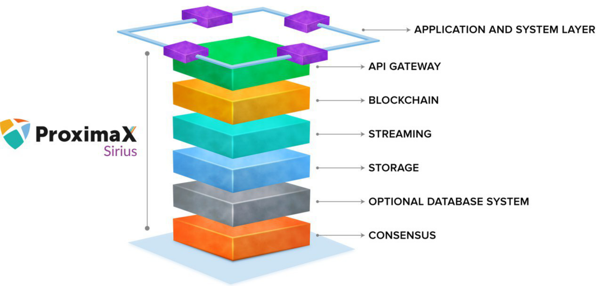
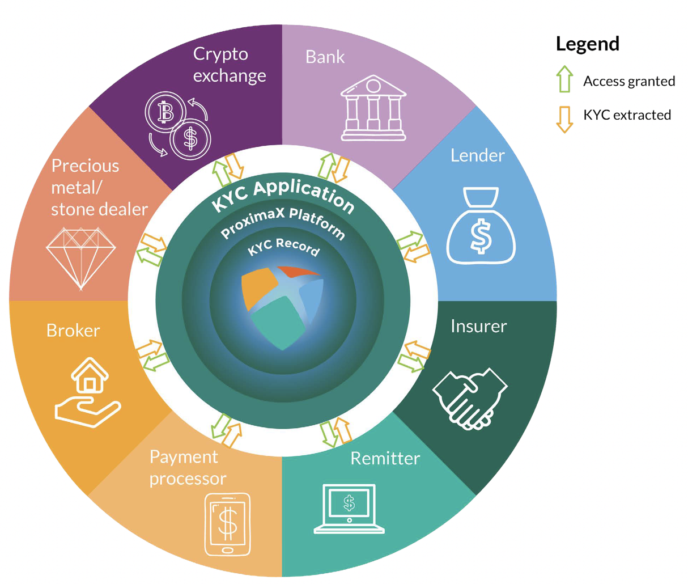

* According to Thomson Reuters, some major financial institutions spend up to US$500 million annually on KYC and customer due diligence. 
* Increasing KYC costs expected for customer onboarding: 19% increase in 2017 compared to 2016 and in 2018, cost is estimated to rise by a further 16%.

**GIBRALTAR, 21 December 2018** - In the increasingly sophisticated business landscape, punctuated with future-proof technologies like artificial intelligence, autonomous vehicles, and proponents for new economies such as  cryptocurrencies, comes now ProximaX KYC, a “Know Your Counterparty” blockchain technology built by ProximaX that simultaneously mitigates risks and speeds up customer onboarding.

Essentially an application running on ProximaX’s robust blockchain-powered platform, ProximaX KYC substantially reduces onboarding time for customers.  On average, it takes about 24 days at any given bank to do so (forbes.com). The quick turnaround time will help stem rapid customer departures from one bank to another due to the cumbersome conventional KYC compliance (Thomson Reuters). 

Thus far, the escalating compliance cost is staggering as Citibank for example, has invested half of its US$3.4 billion efficiency savings in 2015 for “regulatory and compliance activities”. The entry of ProximaX KYC is hence timely to speed up the onboarding process, and possibly assist enterprises and businesses to retain business volume, revenue and profits. Faster onboarding helps to lower customer acquisition cost because operating from an Integrated and Distributed Ledger Technology, as utilised by ProximaX KYC is more cost effective.  

Founder and CEO of ProximaX, Lon Wong affirms his confidence with ProximaX KYC:

> “*Admittedly, we are very confident with the public release of ProximaX KYC especially after having been a firm advocate of blockchain. It is therefore second nature to us at ProximaX to continue to innovate and introduce products that are not only functional but also commercially viable and financially feasible*".

## How does it work?

From a technical perspective, ProximaX KYC harnesses the superiority of the enriched layers within ProximaX Sirius platform's architecture through an API gateway. 

The almost seamless integration feature is an advantage for adoption, especially when customisation is a prerequisite to meet unique onboarding processes of different businesses and organisations. It is quite the norm today where regulators and policy makers both domestically and internationally are also making such KYC necessities into law, primarily to prevent and overcome money laundering activities and terrorism funding. This led ProximaX to develop ProximaX KYC to be GDPR - EU’s General Data Protection Regulation compliant, so that adopters can employ the use of the app without concerns of additional consulting, system customisation and compliance costs. 

The dynamism of ProximaX KYC is reflected in its distributed file management system - DFMS where data is sharded, encrypted, and stored over multiple distributed nodes in a decentralized database.  Security of the sharded data is further protected with private keys before they can be assembled and made legible again. Identity of the individual is pseudonymised by a combination of a public key and unique hashes developed cryptographically (akin to fingerprints). Data stored in such an environment is therefore incrementally shielded with a mesh of security controls. 

## Data Security and privacy

The decentralized environment also upholds data sovereignty where individual users can have full control over their own personal data and only grant permission to trusted users. The permission-rule abides by GDPR’s objective to provide natural persons with “control over their own personal data”. Realising this as a vital universal prerequisite, ProximaX KYC can extend this authorisation feature to corporate-users so they can grant and deny access to their own KYC records. And because ProximaX KYC can be deployed in private networks as well, customer data enjoy added security, even in instances where deletion of records takes place because every action done on the data is timestamped.  The network's distributed nature ensures zero-downtime; when one node goes offline, another will take its place.

*Version 2 of ProximaX KYC will enable permission-based KYC sharing*

        

## RegTech Integration

Another key feature of ProximaX KYC is its ability to integrate with third party service providers or commonly known as Reg Tech - Regulatory Technology. The possibility of using ProximaX KYC becomes comprehensive as it is functionally able to screen for PEPs - Politically Exposed People, sanctions, adverse media, criminal activity, and IP addresses. RegTech integration can extend to credit checks and transaction monitoring.  Latest projects in the works have also shown positive results when integrated with facial recognition and the potential for blockchain forensics analytics.

## Fully Customisable

But while the machinery description all sound rather backend centric, the full feature of ProximaX KYC has also front facing aspects. Other than deploying fully customisable forms to the users for field selection, companies adopting ProximaX KYC can also brand the UI/UX (user interface/user experience) with their corporate identities. From a marketing and communication standpoint, this adds value to a company’s branding endeavour. 

> “*ProximaX KYC is only one of the many apps which we’ve worked diligently for over the months and we’re happy to see the results it has presented itself with today*,” 

beams Lon as he drops hints of more to come from this bold pioneering company.

**About ProximaX KYC**
ProximaX KYC is an app built on ProximaX Sirius. The dynamics within ProximaX KYC has in itself an expansive utility for market adoption that is flexible and can be used for other applications that are not strictly KYC per se, such as user data gathering and registration, and identity management.  Increasingly, there is a need for both financial and non-financial sectors to include KYC as a core element for authentic customer data and compliance. So whether it is for verifying identity or to ascertain source of wealth, ProximaX KYC can assist your staff with performing their due diligence checks efficiently, securely, and in a cost-effective manner. The app is available as a white-label product, meaning it can be rebranded to make it appear as your own, and integrated as an add-on feature to your existing application. Its inbuilt form-builder and APIs for third-party RegTech integration means it can be easily and quickly customised for cross-industry use.

**About ProximaX, Ltd.**
ProximaX Sirius is a next generation platform solution, an Integrated and Distributed Ledger Technology (IaDLT). The peer-to-peer and distributed nature of the solution makes ProximaX a highly sophisticated platform that leverages upon an agglomeration of proven technologies using Blockchain-Storage-Streaming-Database System-Consensus components. The end result in using the ProximaX solution, is a substantial reduction in total cost of ownership, including time to market, and with a superior approach in application design. Any business, including users and KYC applications will have a new and more powerful solution in ProximaX. For more about ProximaX, visit ProximaX.io.

**Contact Us**
Financial institutions, private corporations and technical developers interested in exploring ProximaX KYC can visit [kyc.proximax.io](https://kyc.proximax.io) and contact us at kycinfo@proximax.io.