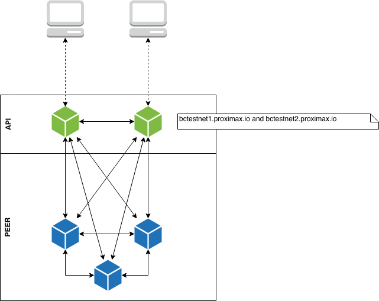
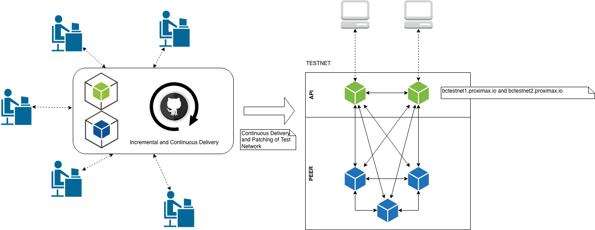

## Blockchain Test Network

We are delighted to announce today that we have deployed 5 nodes for our blockchain testnet. This testnet is based on the NEM Catapult private chain which has been augmented and amended to suit the requirements of the Proximax Sirius platform. We have included in this testnet a Proof of Stake - PoS, which we adapted from the NXT project. We have decided to use PoS instead of Proof of Importance - PoI, because we believe that the PoS will work just as well. Further, PoI has shown to have little impact on the overall score and is closely related to PoS. Eventually the PoS will only be one part of the equation that forms the Proof of Conflation Aggregate - PoCa.

5 Nodes (2 API/3 Peer)

Leading to our main network launch, the testnet shall be used as a staging environment so that all changes and amendments can be tested by everyone in the community thoroughly. In carrying out this testing, we hope that we can highlight and address all security issues before moving to the main network. 

At the same time, we believe that this will be monitored closely by the NEM core development team. In so doing, we hope that they will learn from our experience, thereby making the NEM mainnet a better solution.

### Staging/Preparing Testnet for Mainnet

Our testnet rollouts will be used as a staging platform before we launch the mainnet. We believe that in decentralized technology, it is important that we involve everyone in community in order for us to find issues and bugs before we release the mainnet. By engaging the community in this manner, we are maximizing the chances of a successful platform.

Test Network to Stage/Prepare for Main Network

For now, we are limiting the number of testnet nodes so that we can easily release changes if needed. Once we get to a point that we can engage the public, we will invite volunteers to participate.

### Key Updates On The Blockchain

We have made the blockchain consistent with [NXT](https://nxtwiki.org/wiki/Whitepaper:Nxt) and further optimized it by changing a few object (list to deque) usage as follows:

* New PoS Implementation based on NXT.
* Updated the AccountBalance and AccountState.
* Calculation of the Effective Balance by using the ImportanceView.
    * EffectiveBalance calculation was changed based on NXT to return the effective balance for `1440` blocks instead of `1440` + `720` blocks.
* Base targets stored as difficulties in BlockDifficultyCache.
* Modified the calculation of base targets as per [NXT](https://nxtwiki.org/wiki/Whitepaper:Nxt#Base_Target_Value)

### Future Updates
In addition to this staging platform, we have planned a few more major releases in the coming months. This includes the integration of the reputation system, new transaction types (such as super contract/smart contract extensions) and of course, an upstream upgrade from NEM Technology.

Upcoming updates to our testnet are:
* Merge new changes from NEM (`Bison`)
* New Multisignature Transaction Type for ProximaX Reputation System
* Storage Specific Transaction Types
* Streaming Specific Transaction Types
* Super Contract Transaction Types

### To access our Testnet Nodes
The following is our topology diagram for testnet. We currently have 5 nodes, 2 APIs and 3 peer nodes. We will continue to increase these nodes in the near future and engage community volunteers to participate. 

#### Here are the chain heights for each testnet nodes.
**bctestnet1**
`curl http://bctestnet1.xpxsirius.io:3000/chain/height`

**bctestnet2**
`curl http://bctestnet2.xpxsirius.io:3000/chain/height`

### Websocket Ports
`ws://bctestnet1.xpxsirius.io:3000`
`ws://bctestnet2.xpxsirius.io:3000`

PostMan JSON File [Here](https://ipfs.io/ipfs/QmSQB4xoNeADs3kziQoVfheprQZpLJuxcW3hiPhyD82VyG)

## Software Development Kits
We have forked the NEM SDKs and modified it to suit the purpose of ProximaX. For now, we won't be opening the source since we will still need to modify them for new transaction types that we will introduce. However, we will be inviting a few developers to test out the new SDKs. **More details to follow.**

## Tools
We will also be launching tools such as **Blockchain Explorer** and a **Simple Wallet** soon.
