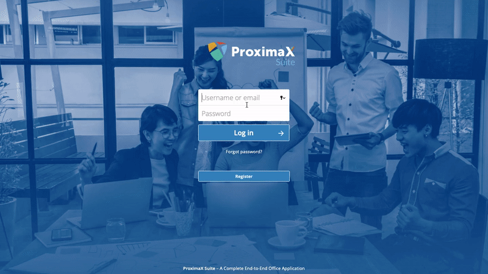

Traditional office settings are becoming less and less common, given that most startups today are adapting to the remote work movement: outsourcing work to overseas teams, collaborating through emails and managing offices all on the internet. And with this comes a rise in the popularity of online collaboration tools aiming to transform the way offices work. But which one really is the most effective? Or which one is the most secure?

With this in mind, ProximaX developed **[ProximaX Suite](http://suite-app.proximax.io)**: A complete end-to-end office application that combines the power of NextCloud File Sync technology, Collabora and ProximaX Blockchain Storage. 

# Boost Your Office Productivity

By utilizing NextCloud's file sync technology and Collabora's Online Office, ProximaX Suite is able to bring you all the office management and collaboration tools that you need to power up your productivity. 

* Create documents, diagrams, spreadsheets and presentations, and share them with others within and outside your organization.
* Access your files, contacts and calendar, and communicate and collaborate anywhere through your smartphone, tablet or desktop.
* Redefine your speed and productivity with our inbuilt messaging and video conferencing tool that allows you to chat or even video call whilst editing your documents. Share and collaborate faster with more meaningful conversations.
* Do more by managing not only your files but people, groups, tasks, events and announcements all within one platform.
* Assign, Restrict and Hide the files you upload using collaborative tags and set of rule groups.

# Blockchain Asymmetric Encryption Technology
The first of its kind, ProximaX Suite deploys a blockchain asymmetric encryption technology that seamlessly enables file owners to decrypt their own files. The naturally demanding asymmetric encryption takes on a pioneering mathematical approach to protecting data, different from most cloud providers’ AES-256 encryption. This means users of ProximaX Suite like you have absolute control to create, edit, share, and delete your own files safely and securely.

# Why ProximaX Suite?
Breaking conventional wisdom, a blockchain powered office application like ProximaX Suite operates from a distributed, replicated and sharded configuration that makes it superior in terms of availability, efficiency and privacy. Our meticulous engineering at ProximaX helps protect your important information from the increasingly rampant incidences of data theft and fraud, occurring at centralised and cloud-hosted sites across the world. With ProximaX Suite, it is time your intellectual property finds a safe and secure haven to stay in.

# Try ProximaX Suite
Try our beta version of ProximaX Suite today. Create an account at https://suite-app.proximax.io and get 5GB of free online storage. Participate in our testing and enhancement process by reporting in our [Trello](https://trello.com/b/K4q0nPia) board.
