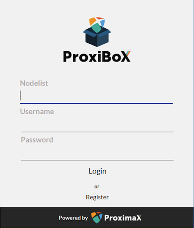

I would like to pen a few words on the activities that ProximaX Tech has been working on over the past several months. Our team has had our hands full ever since we started this project and we are working and pushing hard on all fronts.

## **Pre ICO**

In July / August 2017, we were experimenting on how we could build a solution using the NEM Blockchain and the decentralized IPFS storage solution.
Despite this sounding like a simple solution, this project more than meets the eye in that it addresses a multitude of issues  faced by businesses, enterprises and individuals today. The experiment proved to be successful and we decided to continue with the development of the whole software stack.

## **February to April 2018**

ICO  - Our team put the pieces together for the ICO. We want every aspect of this to be 100% legit and legal. Every applicant for the ICO goes through a stringent KYC process that is based on the laws of Gibraltar, where ProximaX was incorporated. We hire top lawyer, Marc Ellul in Gibraltar to ensure best practices and counselling. 

Concurrently, the Tech Team and I are busy  developing apps to ensure smooth progress of the project. We have our KYC backend process that automates the checks of each input. A script then feeds these entries into an identity management module. Subsequently, this is automatically scanned by the system which will then approve or reject these inputs.

Along with this, we are revamping the Java SDK to ensure that the models are correctly designed. We set up our first nodes on Digital Ocean with regions in Toronto, Singapore, and Amsterdam. These are our first Official ProximaX Version 1 Storage Contributor nodes.

## **May 2018**

We have now the full number of ICO participants and it’s time to organize the distribution of tokens. I built a script to automate this process which makes the delivery easy.

Aside from this, we are also in the midst of hiring people to be part of the core team. Up until recently, I was the sole core developer, but we now have people helping out on our infrastructure and owning the MVP source code.

We are also revamping our initial design of ProximaX KYC from a monolithic to a microservices approach and this approach allows our KYC to be more flexible and robust. We then formed a team to spreadhead, regroup and increase the effectiveness of the KYC project.

This month has also been a memorable month in that ProximaX gained international visibility to the blockchain space during  Consensus New York, together with PeerStream Protocol and Lon Wong who were both present at that event.

The SDK and gateways are now stable and ready to use but still needs to be battle tested. Standards are being set for how this will be deployed. 

## **June 2018**

We have fully migrated the NEM NIS1 version gateways from Digital Ocean to AWS (some of these gateways will be moved to Vultr). Carlo has streamlined all the deployment processes. We have started to ramp up and make more changes to the Rest WS Platform and Java SDK.

We are starting the high-level design work for ProximaX Version 2 to be based on Catapult. At the same time, we started modeling the storage layer.
We have also started looking for more core team members to come into the fold.

We introduce the ProximaX Wallet to the Google Playstore. As of now, the IOS version of the wallet is under review by App Store.

## **July 2018**

We are finalizing the team structure and have started working on the following using the ProximaX Java SDK:
* Revamp of ProximaX KYC Solution
* ProxiBox - a Decentralized file sharing app using ProximaX
* ProxiDocs - NextCloud integration solution with ProximaX
* KeePass + ProximaX - Plugin to use ProximaX to store keepass database
* ProxiERP - a decentralized ERP on ProximaX
* ProxiForum - a forum solution on ProximaX

*Here’s a sneak peek of ProxiBox!*

We have started to lean towards pushing Catapult as our primary blockchain and are continuing to ramp up our team for this purpose.
Given that there is a lot of crucial tech stack within the project, we decided to put leads on top of each tech to create accountability and encourage coordination.

## **Notable activities:**

Consensus mechanism - we have started to do research on how effectively we can design and model the Proof of Storage and Proof of Bandwidth alongside the token economics. We have a team of researchers that are leading this.

Tokenomics - our researchers have a model in mind and we are now in the process of building the model and demonstrations. 

Storage Layer - the team has started to build the Go components we need that will be crucial for our storage layer. This includes the development of Catapult Go SDK and Web Service Platform. We are reviewing the extension Go-ipfs to ensure that we have a pluggable mechanism when we are ready to plug in the consensus mechanism on the storage peer network.

Streaming/Routing Layer - the team is looking at defining the dynamic data store structure and the catapult blockchain. They have also begun to design the node ecosystem and routing layer.

## **Other activities**
* ProximaX Open Apps Foundry
* Open source ProximaX NIS1 Java SDK.
* Plan to Open source the NIS1 Storage Contributor nodes.
* Started to organize updates to the public.

## **Beyond**

Concurrent to all that is happening above, we are in active discussions with close to 35 projects, out of which 21 are in the development phase, testing ProximaX SDKs and integrating our solutions via REST APIs. I cannot disclose the organizations we are working with as we are bound by NDAs but I can say that the use cases thus far cover a broad spectrum of areas and industries spanning education marketplaces, healthcare records systems, supply change management, enterprise resource planning, IoT implementation, big data analytics, energy investments, carbon trading, human resource management and many more.

Moving forward, we hope to provide monthly updates on our activities. In case we miss out some details, we will also be  updating this post.
