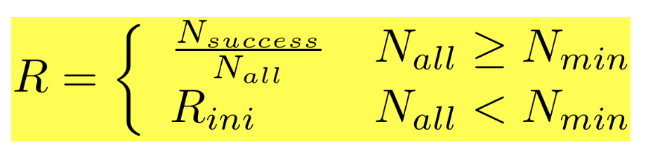
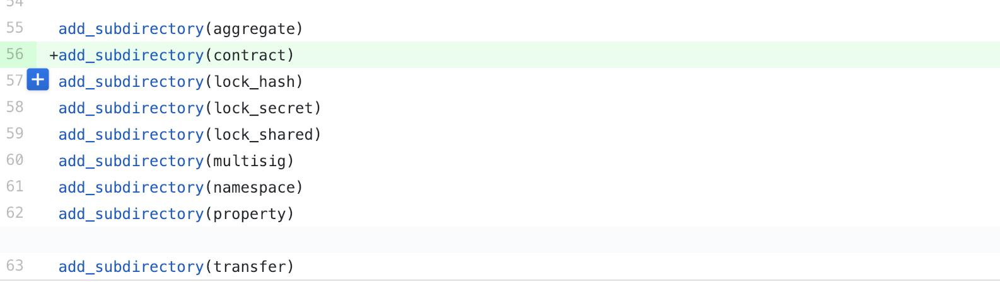

Our updates thus far have been centered around preparing for launching the test networks for storage and streaming, and polishing our technical papers. The team has been very much focused on the core development of components and modules to support our platform engine. 

We have also been working continuously with NEM Core Developers to identify areas for collaboration and integration between our code repositories.

## Storage / Streaming Test Network on the Horizon

### Storage Test Network
After months of intense focus on developing the core components for the storage layer, we are now prepared to launch the storage test network.  The storage layer has different actors and is an entirely different node ecosystem from the blockchain network. This is a ground up solution component that uses a forked version of libp2p and IPFS to enhance communication, improve the distributed hash tables by replacing it with a mesh network instead, and to add in the cryptographic libraries specifically for ProximaX Sirius Storage platform.

The storage layer will introduce a new set of APIs to allow external clients to access the core functions. A separate announcement and documentation will be provided for this.

### Streaming Test Network
Similar to the storage test network, the team has worked tirelessly until the end of 2018 to prepare for the upcoming streaming testnet launch. The streaming test network is slated to launch within Q1 2019, but we would be able to spin up an early version of the streaming layer component this month alongside the storage layer.

The first version of the test network will feature anonymous/secure text and data streaming only. This will be the foundation for the rest of the features as it acts as a distributed presence service for all applications/clients that will utilise the streaming layer.

### Similar to Blockchain Test Network
Much like the blockchain test network, we are launching a test network for each layer as a way to stage our changes and prepare for the community engagement process. This will all be announced separately.

## Blockchain Layer Enhancements

### Market Mechanism

Various agents compete for doing the task in an open market model. The core objective of the market is the following:

+ The selection of contragents for doing the task in the open market - be it storage or verifications
+ Accepting the outcome of actions in tokens 
+ Changing the reputation index accordingly

### Reputation System
Reputation is a metric, associated with each account, which can be calculated from the history of transactions.  It can be expressed in a formula such as
  

 
**where**

+ *Nmin* - some pre-configurated minimum number of contracts 
+ *Rini* - initial value for reputation until a node has no Nmin contracts
+ *Nsuccess* - number of successful contracts finished by a node
+ *Nall* - number of all contracts in which a node had participated

Reputation is considered by the node selection mechanism. An agent with a lower reputation index will have a lower chance of getting selected. Reputation with vesting gives us a mechanism to penalise and incentivise the users based on their performance. This assigns users an identity which could affect their chances of being included or excluded from group consensus. This in turn encourages the best possible performance from each user. 

### Contract Namespace/Object
Since we are introducing a few new contracts, we have extended ProximaX Sirius (NEM Catapult) and created an abstract contract object that will form the basis of our new contracts. We are looking to use this similar abstraction for our eventual implementation of super contracts.

### New Contract - ModifyContractTransaction
With the new reputation system in place, we need to build a specific transaction/contract type for the storage layer. To do this, we developed a new contract called ModifyContractTransaction that contains the details of the following: duration, multisig account, file hash, customer, executors (e.g. storage nodes), and verifiers.

## Papers
We now have a few papers that are being finalised that will be published soon:

+ Updated White Paper
+ High Level Technical Design
+ Token Economics Modeling
+ Storage Streaming
+ Traceability of Storage Streaming
+ Proof of X Schema
+ Blockchain Performance Metrics

## Application Development
We've started a bunch of applications a few months ago and most of them are already complete. We are bundling these applications as part of our offering.

+ ProximaX Suite (formerly ProxiSuite) is an office suite application backed by ProximaX Sirius' blockchain and storage.  It is part of the optional software pack.

+ ProximaX File It!, ProximaX Notes, and ProximaX Vault (formerly ProxiBox, ProxiNotes, and ProxiKeepass respectively), are ready and we are now selling these tools as part of the collection of utilities that we bundle along with the catapult infrastructure. ProximaX File It! is a decentralized file management system that can be used to securely share files. ProximaX Notes is a note taking desktop application primarily used to securely store encrypted text-based format files, and ProximaX Vault is a password manager that uses keepass database stored securely via encryption on ProximaX Sirius' blockchain and storage. 

+ Explorer and Wallet are also part of an optional bundle so that customers can use or play around with ProximaX Sirius' blockchain as soon as we provision them.

## Summary
Below is a summary of what we have done in December:

+ Development of core contracts and NEM Bison merge on ProximaX Sirius Blockchain Layer
+ Development of storage core code and the complimentary components such as cryptographic libraries, software development kits, and utilities
+ Development of streaming core code and software development kits
+ Preparation for testnet launch of storage and streaming
+ Regularly updating the papers such as technical white paper, token economics, proof of x schema, storage streaming, and performance metrics