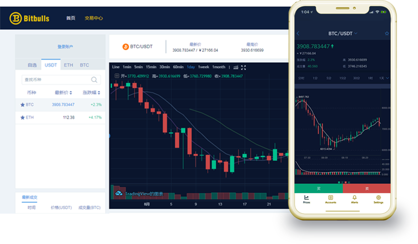

We are delighted to announce that XPX has been listed on Bitbulls, a digital asset trading platform registered with and regulated by the [Australian Securities and Investments Commission](https://connectonline.asic.gov.au/RegistrySearch/faces/landing/SearchRegisters.jspx?_adf.ctrl-state=85ap8xknd_12).

Bitbulls' mission is to build a new, more sophisticated digital economy ecology through the provision of a complete range of digital financial services and it envisions a world where everybody benefits from the adoption of blockchain technology in the digital economy.

To learn more about Bitbulls and start trading, [click here](https://www.bitbulls.com/index).

