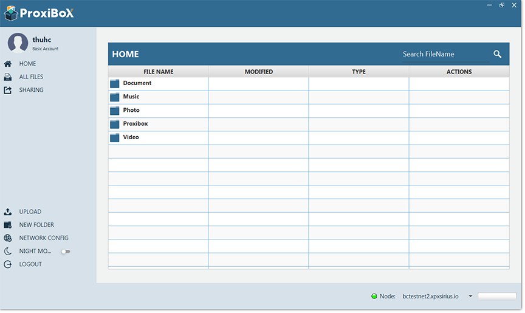
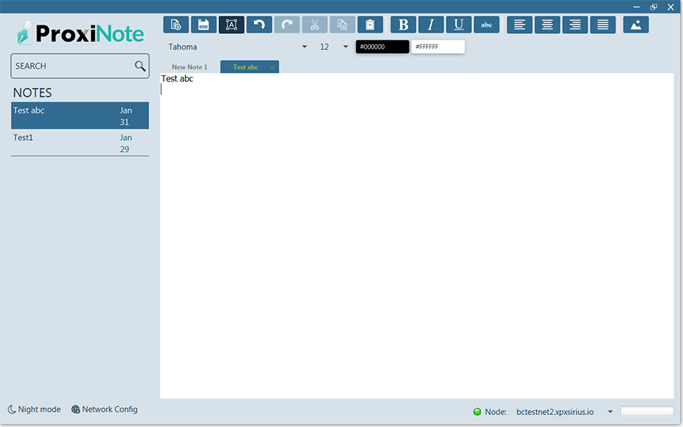
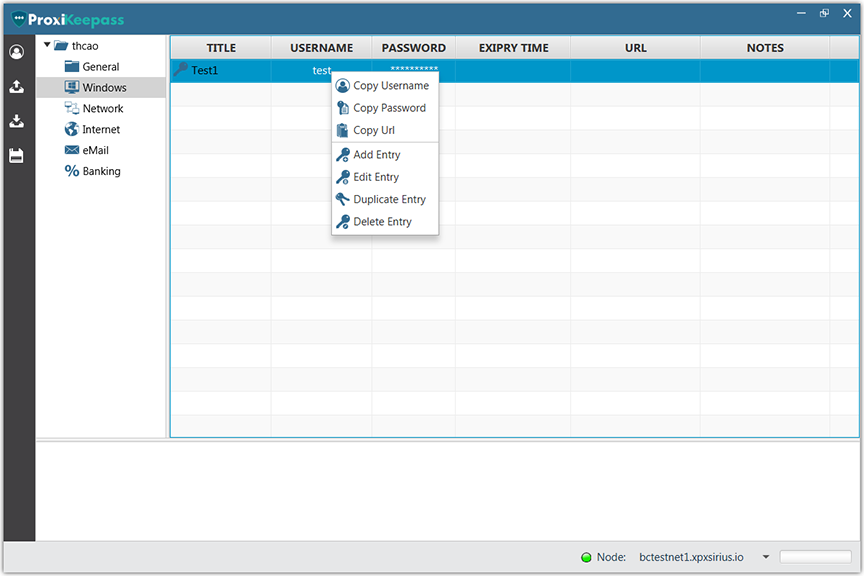

ProximaX is committed to developing decentralised applications ("DApps") that will help you do more and boost your office productivity without compromising the security of your data. Along with these DApps are File It!, Notes, and Vault which are already in their final testing phase. 

# ProximaX File It!
ProximaX File It! is a stand-alone desktop file management DApp. Its primary use is for storing, sharing and editing files across multiple customers and clients. With blockchain and distributed file management at its core, you can be confident that your files are in a secure and safe location.

### File It! Features
* Acquire an account with your existing ProximaX private key.
* Upload and share files as public, encrypted with keys or encrypted with password.
* View and edit text documents.
* Download and store shared files locally.

# ProximaX Notes
ProximaX Notes is a DApp designed for note-taking, organising, task lists, and archiving. It allows users to create notes in text format. ProximaX Notes works cross-platform and includes support for Linux, Microsoft Windows, and MacOS. It is a simple note-taking application which utilises powerful blockchain-level encryption, allowing users to fully encrypt and secure their notes.

### Notes Features

* Create, view, edit and delete notes.
* Basic text styling.
* Image attachment.
* Night mode theme.
* Blockchain AES-256 encryption technology.
# ProximaX Vault

ProximaX Vault is a password manager DApp with similar functionality to LastPass, Keepass, and Dashlane. However, unlike these conventional password manager applications, ProximaX Vault is backed by blockchain-based encryption technology where your information is encrypted and distributed across various nodes, making it impossible for anyone to access your authentication credentials without permission. This superior DApp allows you to manage and securely keep your passwords for your user accounts, whether it is on the web, on desktop applications, email addresses, and even banking. 

# Stay in the Loop
To know more about the development of ProximaX's DApps, sign up for a [ProximaX Suite](http://suite.proximax.io) account today and get updated with our latest development announcements or join our official Telegram group for developers: [ProximaX Devs](https://web.telegram.org/#/im?p=@proximax_devs).