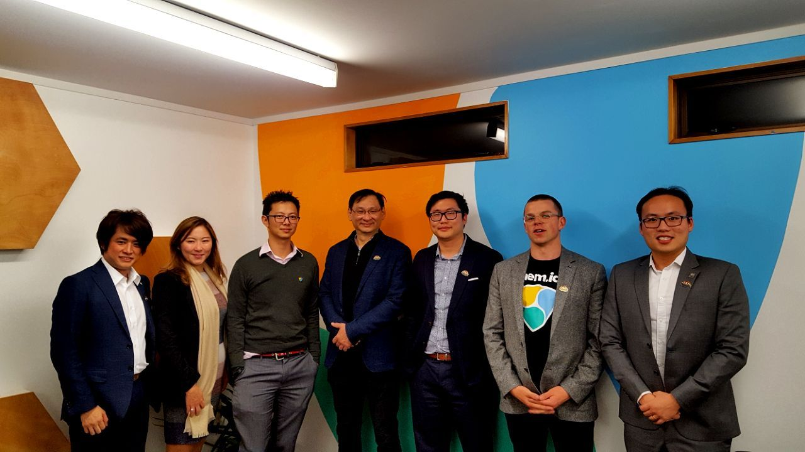
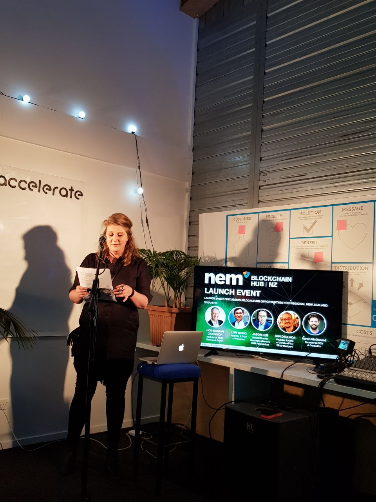
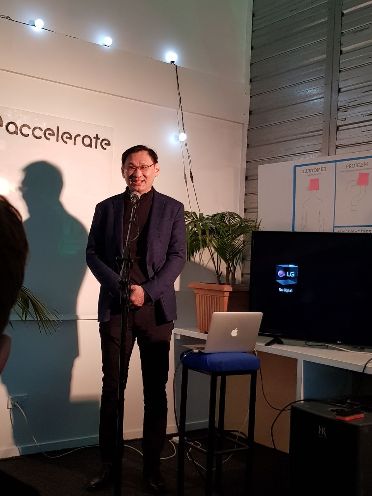
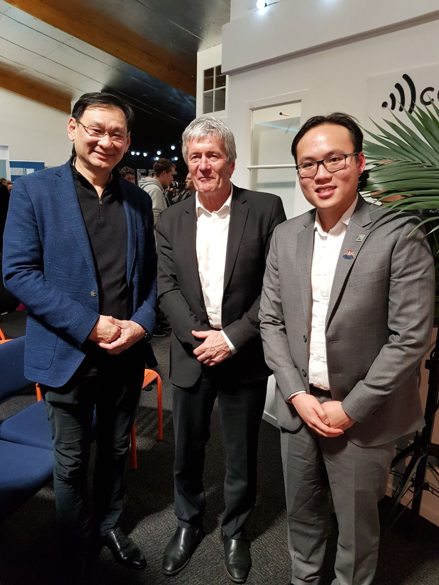

What a memorable evening it was last Wednesday, 25th July 2018, when ProximaX Founder and CEO, Lon Wong was invited to speak at the grand opening of the NEM Blockchain Hub in the lovely town of Westport, New Zealand. In his speech, Lon expressed his delight at the way NEM was blazing the way to help communities, especially ones in the more rural areas to embrace blockchain technology and create job opportunities to become centers of growth and excellence. 

Lon, who was a founding member and the first President of the [NEM.io](https://nem.io) Foundation explained that ProximaX, which is an extension of the NEM Blockchain, would endeavor to hold the hands of local industries and government in adopting blockchain technology for an array of use cases such as medical health records, land registry, car registrations, identity records and archiving.

Other prominent speakers for this launch were Hon. Damian O’Connor, Minister of State Trade and Export, Benjamin Dellaca, Founder & CEO of [Cerebralfix](https://cerebralfix.com/) / EPIC Westport, Caleb Yeoh, CEO of [TravelbyBit](https://www.travelbybit.com/), and Jason Lee, NEM.io Foundation’s Expansion Director for Australia and New Zealand. We were also honored to have Chairman Andrew Robb, of the Regional Council and Mayor of the Grey District who was out of the country to address the guests at the launch via a pre-recorded video.

Many distinguished guests were present that evening, including Mayor Garry Howard of Buller District Council Mayors, Mayor Bruce Smith of Westland District, Council Members, representatives and leaders in the New Zealand Crypto and Blockchain Ecosystem such [Cryptopia](https://www.cryptopia.co.nz/), Blue Block and [Bitprime](https://www.bitprime.co.nz/), and NEM representatives from Japan, Malaysia, Australia and New Zealand.

To stay in touch with what is happening in New Zealand, join ProximaX’s latest telegram community at https://t.me/proximaxnewzealand

