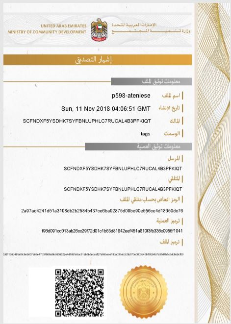
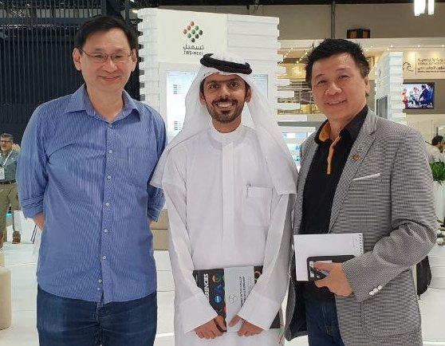

ProximaX 在短短 2 周内为阿联酋国社区发展部（MOCD）提供了功能强大的区块链 ProximaX Sirius 平台 和解决方案。

直布罗陀 / 迪拜 / 2018 年 11 月 14 日 - 阿拉伯联合酋长国社区发展部 - MOCD 今天宣布，他们已经推 出了一项概念验证 - PoC，由 ProximaX Sirius 区块链平台提供解决方案。

ProximaX 和 NEM 基金会共同致力开发解决方案，其中 ProximaX 提供了 Sirius 平台，集成了 Apostille，并完成了 MOCD 的投票模块。

*Apostille Notarization for MOCD*
 
ProximaX Sirius 平台包括分布式文件管理系统，工作协作模块和企业版的 NEM 投石车（ Catapult） 私 链解决方案。 
 
如今该平台的运用使 MOCD 能够开始在开发和推出区块链计划的同时，继续增加更多的应用程序。 
 
通过在 Sirius 平台中添加更多组件，能够进一步增强该平台功能，其中包括流媒体和信息传递解决方 案，分散式数据库解决方案以及权限解决方案。 

 
阿联酋国社区发展部部长顾问 Saeed Abdulla 先生表示，“我们对这项概念验证如何在 2 周内完成印象深 刻，我们很高兴通过这项概念验证，我们可以继续在 ProximaX Sirius 平台上开发和部署更多解决方 案。在接下来的几个月中，我们将计划如何在该平台中添加更多模块和应用程序。通过这项概念验证， 我们希望能够实现在 2021 年成为区块链政府的愿景。 

*Lon Wong, Saeed Abdulla and Stephen Chia* 
 
该 Sirius 平台还可以为跨部门提供技术对接服务，通过使用权限 API 允许其他区块链解决方案与该平台 结合。 
 
“该解决方案旨在实现轻松部署，因此我们在短短 2 周内完成了此项概念验证。它确实是世界级的企业 版解决方案。” -  ProximaX 首席执行官 Lon Wong 表示。 
 
Lon 进一步补充说，这是一个非常强大的解决方案，因为它具有企业级平台的大多数基本元素，可以使 用区块链作为不可变更数据记录来提供任何解决方案。与系统中的其他组件相结合，它还允许数据交 易。所有数据都经过加密，从而产生高度安全的信息和数据记录以及存储。

 *Wallet page*
 
“与 MOCD 的谅解备忘录进一步证明了 NEM.io 基金会章程如何帮助生态系统参与者共同为客户提供最 佳解决方案。ProximaX 已经证明了实施 NEM Catapult 解决方案是多么容易，我们相信从这里向前迈 进，我们应该看到更多的 Catapult 在工业中被采用。“ -  Stephen Chia，NEM.io 基金会理事会成员和东 南亚（SEA）运营主管。 
 
ProximaX，通过 NEM 基金会，将承诺并继续支持 MOCD 进行全面部署，平且希望这个解决方案将被其 他部门采用。 
