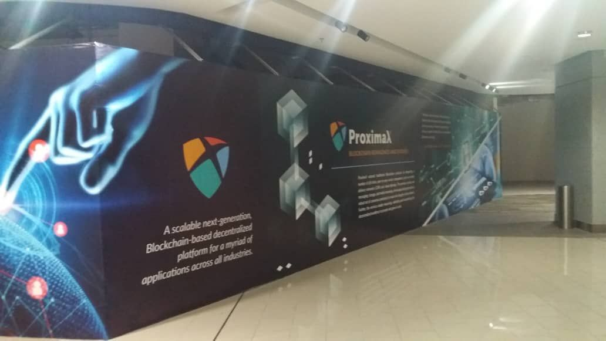
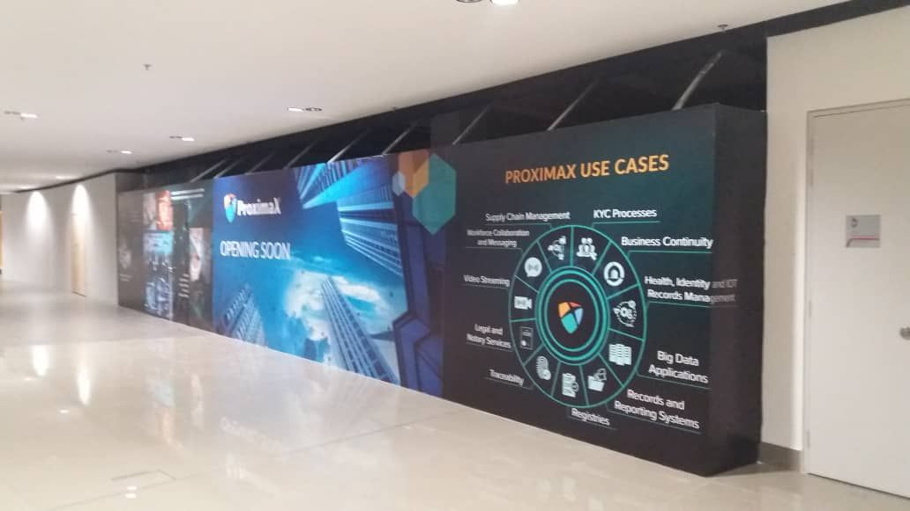
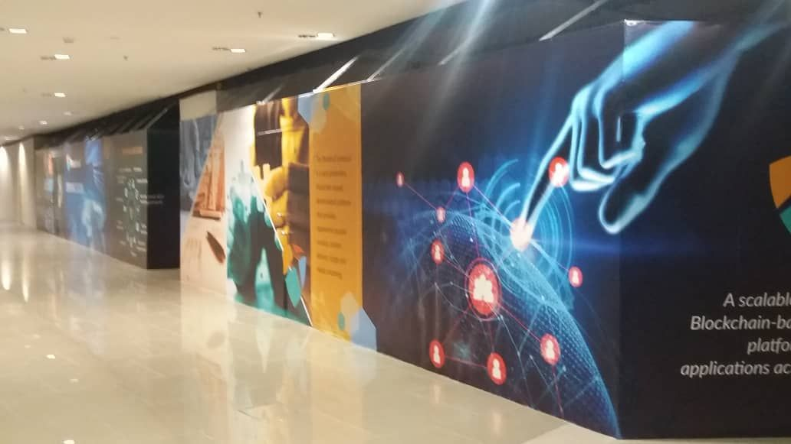
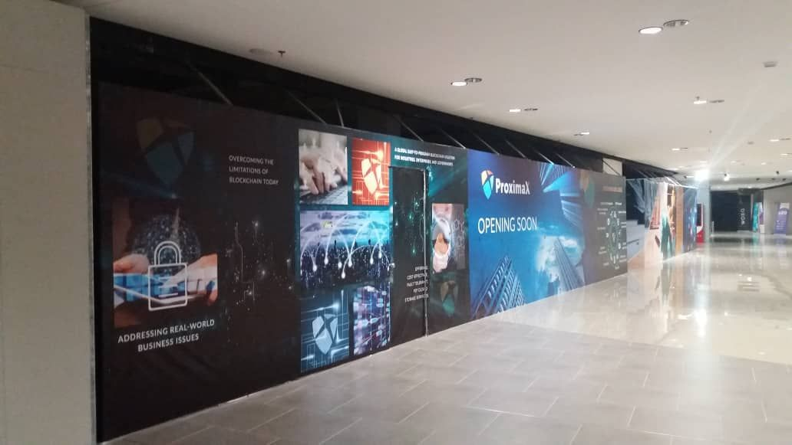
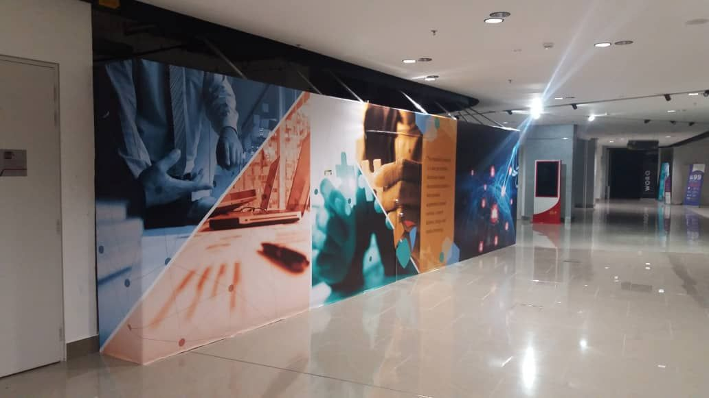

ProximaX has commenced renovation work on a 580sqm acceleration centre in Kuala Lumpur, Malaysia today. As a next generation blockchain solutions provider, the purpose of this centre is to bring togther software developers, start-ups, exchanges, business users and the blockchain community together in a condusive working and learning environment, and to help accelerate the adoption of ProximaX's solutions. 

The ProximaX Acceleration Centre (PAC) will be located in GLO Damansara which currently houses the NEM Blockchain Centre and will feature state-of-the-art and conducive co-working spaces, offices, and meeting rooms. This PAC is the second such facility following the one in HaymarketHQ, Sydney, Australia which was opened earlier this year. 

ProximaX is an advanced extension of the Blockchain and Distributed Ledger Technology (DLT) with utility-rich, industry standard services and protocols. The ProximaX team is currently engaged with over 40 organizations that are keen on adopting various aspects of ProximaX's solutions, ranging from identity management to traceability to video streaming. 

Stay tuned for more updates on the PAC!

