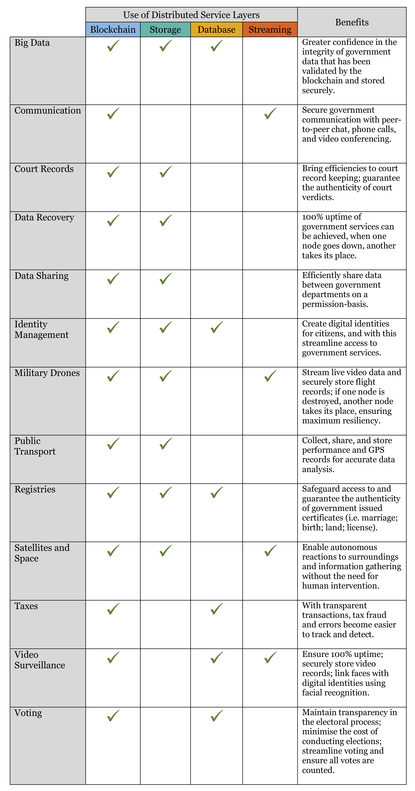
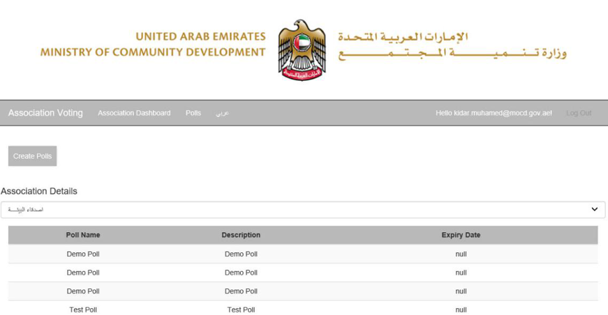
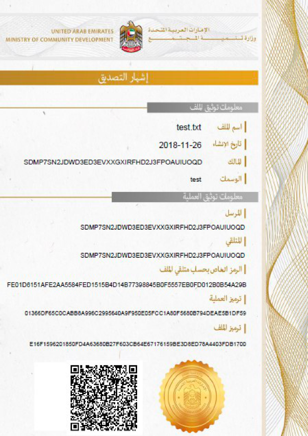

## A Holistic Platform for any Government Solution 

A dedicated team of ProximaX developers are building government solutions that can be used to maximise data security, make processes more efficient, and in turn save on costs.

With our platform, ProximaX Sirius, we can offer an integrated assembly of proven distributed technologies, Blockchain-Storage-Streaming-Database System-Super Contracts-Consensus.  It has every component needed to power a government system or standalone app, whilst substantially reducing the total cost of ownership.

Network deployment is swift, it can occur within days.  Integration is kept simple, via an API gateway.  This in turn allows government departments to focus on building their solutions vertically on top; minimal knowledge of the underlining distributed technology is required.  

## What are the Benefits?

* Use of a highly available, integrated, and distributed network means that the uptime of government systems and services is guaranteed.

* Permission-based access, and encryption by default, ensures maximum security, privacy, and tamper-resistance for government data.

* Data transactions are recorded on an immutable ledger, so that the location of government data on a distributed network is known and can be audited at all times.
 

## Potential Government Uses

What can be built on or migrated over to a government owned distributed network is only limited by your imagination.  Potential uses can include:

## ProximaX Case Study: United Arab Emirates

The Ministry of Community Development ("MOCD") of the United Arab Emirates has rolled out a proof of concept powered by the ProximaX Sirius platform, which includes notarisation and voting modules.  

The voting module has been further extended to include a categorised voting mechanism that is backed by blockchain with the results stored in a distributed file management system (storage layer).   Its new functionality includes enterprise voting for members of board of directors at government owned entities.  

Customised voting module:
 

According to Mr. Saeed Abdulla, Minister's Advisor at MOCD:

> “We are impressed with how the PoC was completed in two weeks, and we are excited that with this we can continue to develop and deploy solutions on the ProximaX Sirius platform. 
> 
> In the following months, we shall be looking at how we can improve and add more modules and applications onto this platform solution. 
> 
> With this PoC we hope to be able to achieve our vision of becoming a blockchain-enabled government by the year 2021.”

Sample of notarisation certificate: 

ProximaX developers continue to work closely with the UAE government on a daily basis to build out their solutions and help achieve their ambition of capitalising on blockchain technology.

## About ProximaX, Ltd.

ProximaX is a next generation platform solution, an Integrated and Distributed Ledger Technology (IaDLT). The peer-to-peer and distributed nature of the solution makes ProximaX a highly sophisticated platform that leverages upon an agglomeration of proven technologies using Blockchain-Storage-Streaming-Database System-Super Contracts-Consensus components. The end result in using the ProximaX solution is a substantial reduction in total cost of ownership, including time to market, and with a superior approach in application design.

## Contact Us

Local and national governments interested in exploring the use of ProximaX technology can find out more at  and contact us at info@proximax.io.
