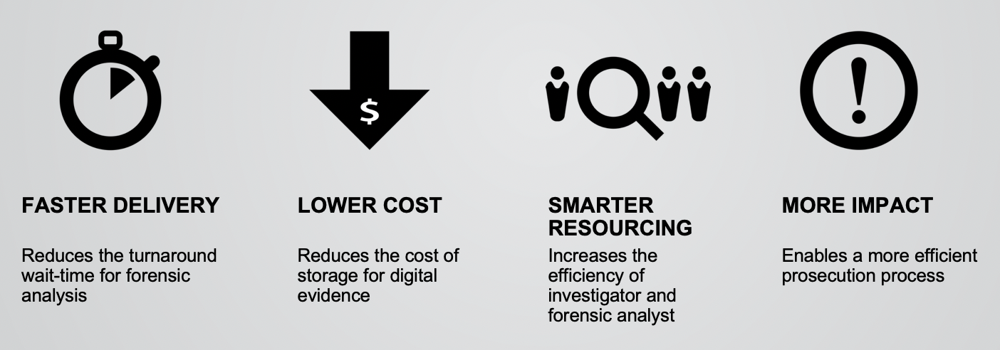
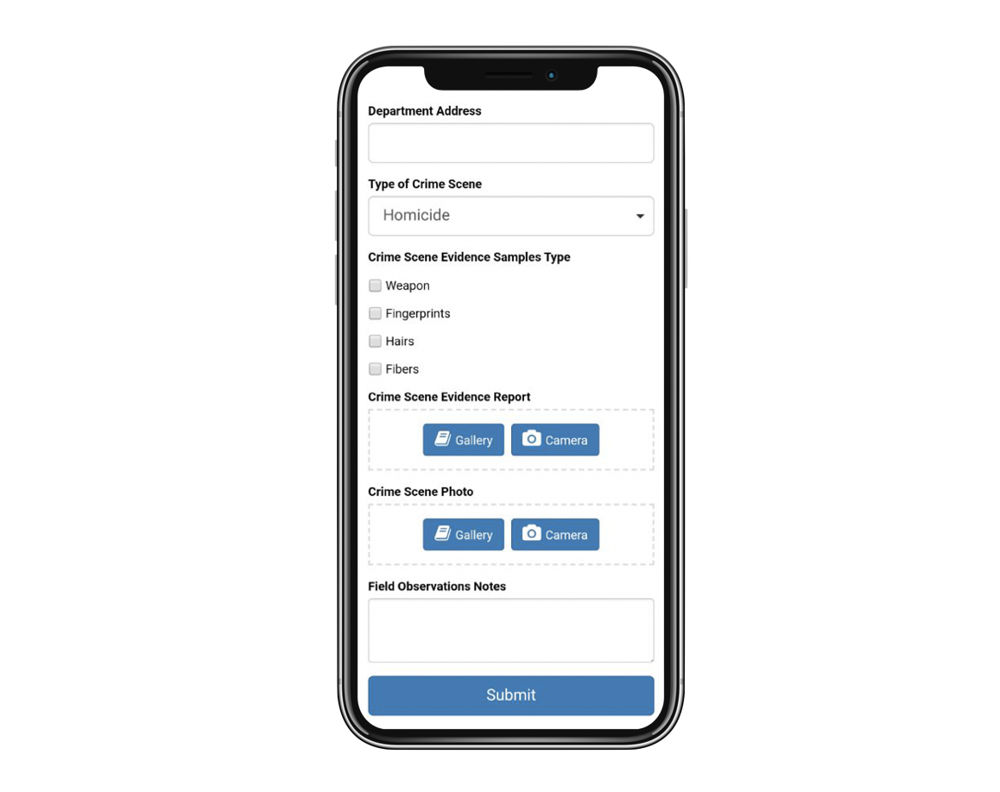
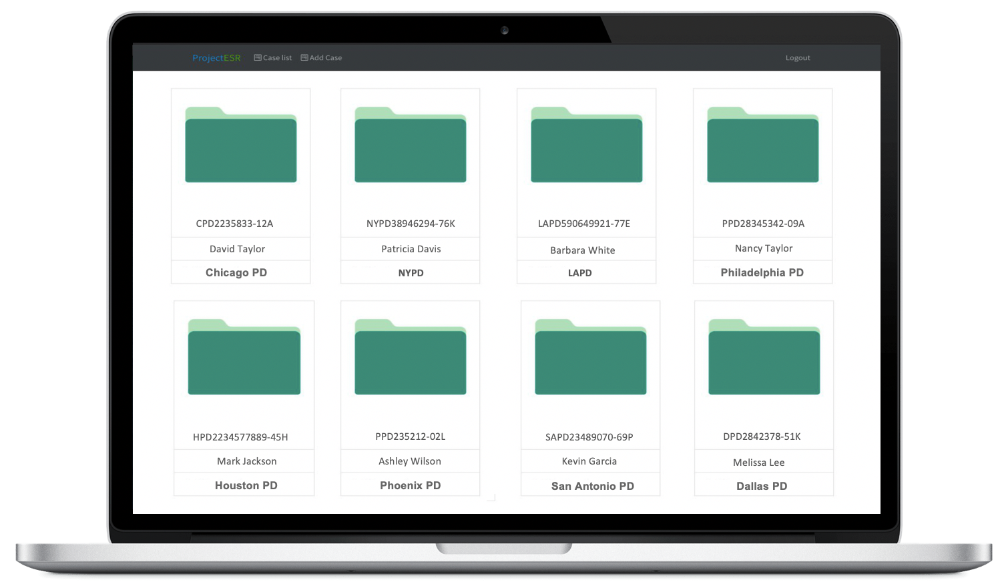
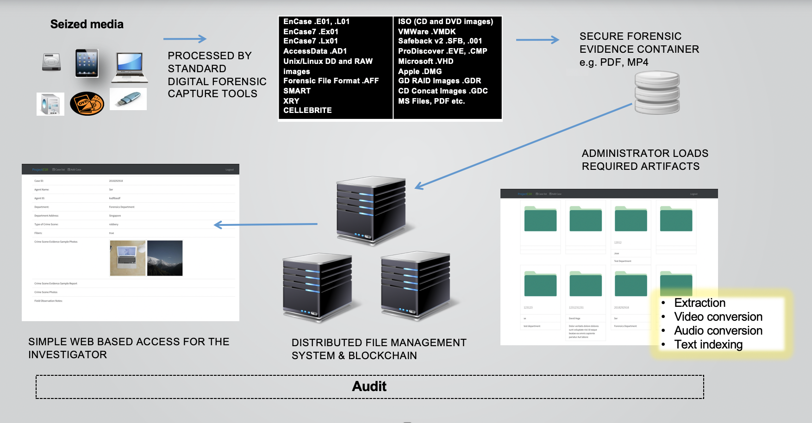

ProximaX Forensics, powered by the ProximaX Sirius platform, is an app that is designed to bring about greater efficiencies and data security for investigators and forensic scientists.

* Puts digital evidence into the hands of investigators more quickly
* Reduces the complexity of accessing digital evidence
* Stores digital evidence in a secured environment 

## The challenge brought by digital footprints in criminology 

The exponential growth of data has made a big impact on criminal investigations and prosecutions.  Whether it comes from traditional hardware, or new types of IoT devices, such as wearables, home applications, or drones, almost every criminal case now has a digital footprint.  

The challenge is that investigators need to collect and look through vast amounts of data, and be able to articulate where the digital evidence was found, how it was collected, and how it was processed.  This is where ProximaX Forensics app steps in.  

## What does ProximaX Forensics app offer?

**Guaranteeing integrity, authenticity, and auditability**

With ProximaX Forensics, blockchain technology is used to enable a comprehensive view of transactions (events/actions) back to origination, in turn providing the opportunity for greater integrity and tamper-resistance for digital forensics custody chains.    

**Easy access through a web application**

Investigators can review case data remotely in their own time without the need for a forensic analyst.  All that is needed is an internet connection. 

**Powerful searching functionality**

Advanced content searching using elastic search via the simple user interface with dictionary keyword searching across all data.  Users require no technical knowledge of forensics or computers in order to find and analyse digital evidence.

**Bookmarks and tags**

ProximaX Forensics allows the simultaneous viewing of multiple compartmentalised instances of the same case file. This enables multiple viewers, such as a team of investigators working together on a case, to view a single instance of the case file with shared bookmarks to create a single report.

**Protects legal privilege**

ProximaX Forensics enables any material identified as legally protected or privileged to be classified and appropriately protected and encrypted so that it can only be viewed by authorised personnel on a permission-basis, with the ability to share case files across criminal departments, states, and internationally.

**Mobile devices** 

Transferring data from iOS and Android devices to make the data rapidly available to investigators in an intuitive timeline or thread view. 

Architecture overview: 

For more information, please contact info@proximax.io.
