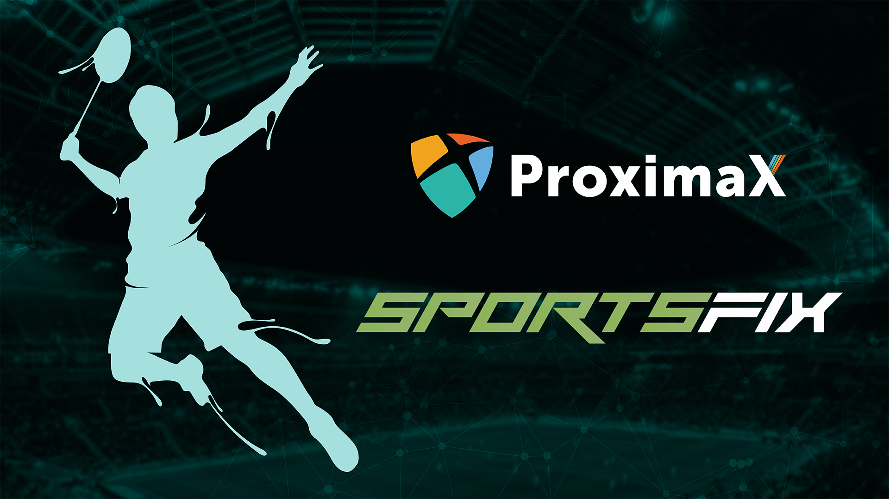

Game Changers! We are thrilled to have ProximaX sponsoring our Game Day Pass for SportsFix Digital Stadium.

Whilst we've been busy managing our partnership with one of Indonesia's largest telecom service provider XL Axiata, we've also been working hard behind the scenes on a new exciting partnership with ProximaX to sponsor Game Day Passes for Badminton World Federation (BWF) Victor Korea Open 2018 in Indonesia.
Scheduled from Sept. 25 to 30 in Seoul, the Victor Korea Open brings some of Indonesia's best badminton players, including but not limited to Asian Games Champion Jonatan Christie, Top 10 Men's Singles player Anthony Sinisuka Ginting, and World Tour's #1 Tommy Sugiarto.

This partnership is initiated by [SportsFix](https://sportsfix.io/) to deliver Game Day Passes to stream the tournament's matches on Sept. 28. Using a Game Day Pass, a fan can enjoy a whole day access to stream matches on [SportsFix TV site](https://sportsfix.io/), [indonesia.sportsfix.tv](https://indonesia.sportsfix.tv/).

> SportsFix CEO Carl Kirchhoff welcomes ProximaX. "Having ProximaX sponsor our Game Day Passes is a strong indicator that our Digital Stadium ecosystem and Sponsorship Model are attractive not only to the mainstream tech industry, but also for the blockchain industry."

> He continues. "We look forward to announce more of those partnerships with other large crypto players in the space soon to support our goals of using sports as a vehicle for mass adoption of cryptocurrency. No other company has this potential and both our team and investors are working diligently behind the scenes to make a major impact to the entire blockchain/ crypto community."

The [Sponsorship Model](https://medium.com/@sportsfix/former-ioc-director-michael-payne-joins-sportsfix-advisory-board-b6100a3c6a13) is a decentralised sponsorship scheme, as opposed to the centralised model used by traditional TV broadcasters. SportsFix' sponsorship model will marshall social media influence of sports fans to create a viral growth loop for the Digital Stadium, allowing sponsors and brands to have 1 on 1 engagement with fans and own 100% share of voice.
ProximaX will be the first blockchain technology company that takes part in our Sponsorship Model of the Digital Stadium ecosystem. Developed by key people behind the NEM blockchain platform, ProximaX is a consensus algorithm-based platform that combines blockchain, storage, and streaming to enable an all-in-one platform for multi-industry application and decentralized app development.

> Founder and CEO of ProximaX, Lon Wong is excited with the onboarding of ProximaX. "SportsFix is a traditional business that demonstrates the use of a consensus mechanism from its members to get the right to view a video play. It is novel indeed, what more, the very concept of it syncs with the blockchain design method."

Besides sponsoring our Game Day Passes, ProximaX will further work closely with SportsFix to advance Digital Stadium features utilizing their existing technology and services.

> Wong elaborates. "We, at ProximaX, are indeed happy to support the use of our platform to make this possible from the storage, voting, and management of member accounts perspective."

Home for badminton in Indonesia, SportsFix is an OTT platform to live stream leagues and matches based in Kuala Lumpur. In 2017, SportsFix launched its OTT platform and has been delivering some of Southeast Asia's most popular sports content from Liga 1 Gojek, Serie A, MMA GLORY, to world's most prestigious badminton tournament, the all-year BWF tournaments.

IT'S GAME TIME! And we're changing the way YOU watch sports!

Follow us on Twitter: @sportsfix_io
Subscribe to our Telegram group: t.me/SFICO
Check out our ICO website: www.sportsfix.io

---

**Repost from:** https://medium.com/@sportsfix/proximax-sponsors-sportsfix-digital-stadium-for-bwf-victor-korea-open-db8dcde83404
