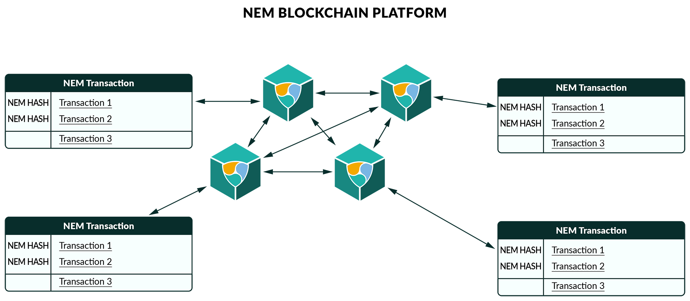
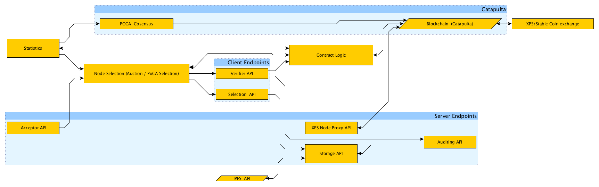
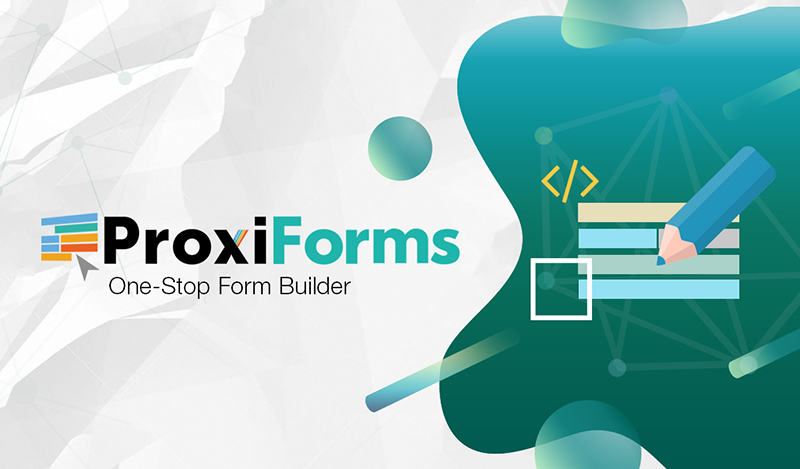
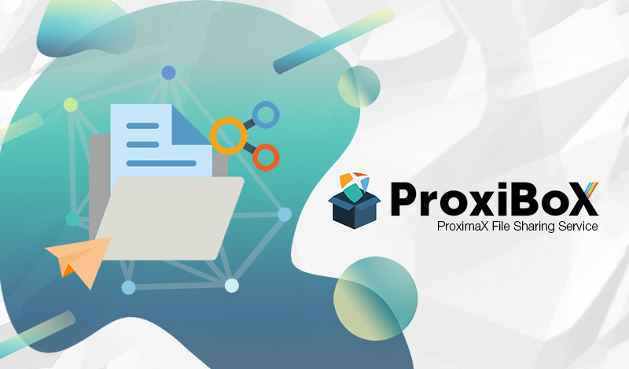
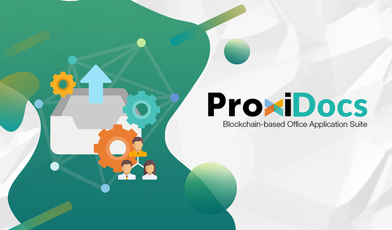
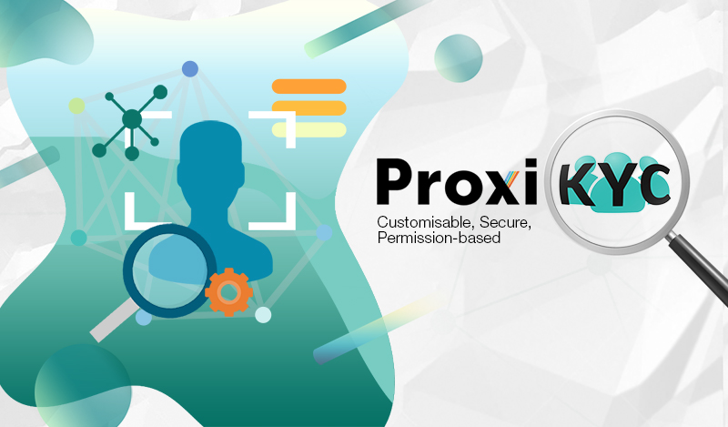
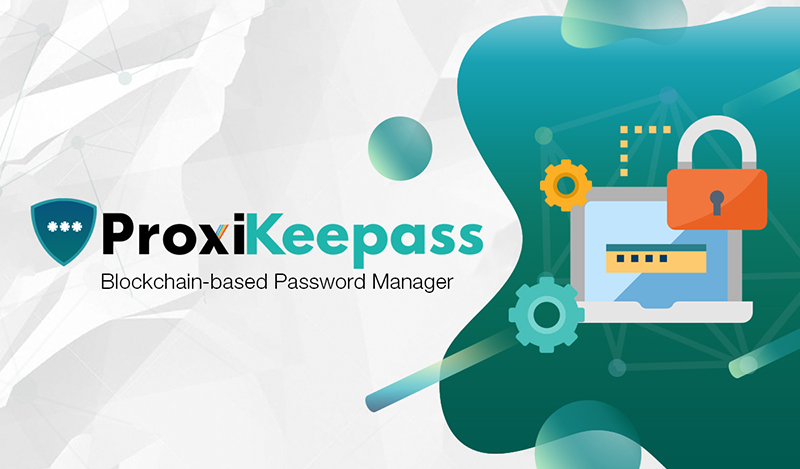

The month of August is where we began our challenging feat of building the blocks of ProximaX as we envisioned it. This includes the formal verification of our design of the consensus mechanism, token economics as well as the architecture of the functional components needed to implement the storage and streaming platforms. This design is the basis and framework for the ProximaX platform.

Key updates this month include core development activities, application development and cloud infrastructure offerings. We also increased our staffing substantially and brought in industry experts to boost up and achieve our goals.

## Core Development

### ProximaX Platform Storage - Version 1 (NIS1)
We uploaded the Docker Compose - a tool for defining and running multi-container Docker applications - for the ProximaX storage platform that includes our fork of IPFS and a REST Web Service built in Java. This will allow anyone to start their own storage contributor node, participate on the global IPFS network and directly host any application via the NIS1 compatible SDKs. 

A quick diagram below shows how we extend NEM's Transaction by putting the decentralized storage node hash as part of the message payload.

Diagram 1.0 - Data is rooted to the NEM Transaction. Side by side integration of two decentralized technologies.

#### NIS1 Docker Storage Contributor Node
We have open sourced the docker container that can be run by anyone who wants to start their own storage contributor node. 

* [ProximaX Platform NIS1 Docker Compose 0.1.0-beta](https://github.com/proximax-storage/proximax-platform-nis1-docker-compose ) 

#### NIS1 SDKs
We have open sourced both the Java SDK and Typescript/Angular SDK for developers to build and power their apps using the ProximaX storage platform. The Docker Compose for the storage platform for NIS1 is also available to people who want to launch their own storage platform.

In the recent months, several companies have tested the platform and given good feedback about it. However, most of them want to use the Catapult version and our team has hence shifted focus to this. 
 
*  [Java SDK 0.1.0-beta](https://github.com/proximax-storage/xpx-java-sdk)
*  [Typescript/Angular 0.1.0-beta](https://github.com/proximax-storage/xpx-typescript-angular-sdk ) 

### ProximaX Platform Storage - Version 2 (Catapult)
The team has been working hard for the past couple of months and has been developing and designing the core ProximaX Platform Storage version 2.

We have four core compenents: storage, streaming, consensus and the blockchain layer. In the entire ecosystem and platform of ProximaX, we will be using multiple consensus mechanisms that's implemented on all node actors. We decided to use Proof of Stake (**PoS**) using NXT as a reference implementation for the blockchain nodes and a new approach called Proof of Conflation Aggregate - **PoCa** that takes the weight of Stakes, Storage and Bandwidth for both Storage and Streaming layers.

#### On the Storage Layer
The core components are almost complete and we're now building the API pieces. These components will be the main handles that will build up the storage contributor node in the ProximaX system. A storage contributor is a critical host, replicator, and verifier of the storage ecosystem. The proof of conflation aggregate - PoCa - applies to participating nodes. The storage and bandwidth carry more weight as opposed to stakes in the PoCa .

Diagram 3.0 - Storage Platform Components Design

We are finalizing the token economic model that will support the economic model of the platform. In ProximaX, there are a few actors: users, Dapp service providers and storage / streaming resources. Users are the primary consumers of either the Dapp service provider or storage resource while the Dapp service providers are the users of the storage resource that provides services to consumers. 

The XPX token can be extremely volatile since it is an utility token. Our research and design approach is to use a stable coin that is pegged to a fiat value. The stable currency will be naturally controlled by a special mechanism.

**The Storage SDK** is progressing well. By the end of the month, we would be releasing the initial versions of the Storage SDK in Java, C# and Javascript/Typescript. These will allow clients to build applications that can communicate with Private Catapult and Storage API.

#### On the Streaming Layer
The functional design of the core and routing mechanism is being developed. PeerStream protocol (PSP) is a distributed decentralized streaming protocol that is designed to provide high quality decentralized streaming services for ProximaX Dapps engaged with privacy and security features. PSP is a privacy real-time stream routing protocol that is capable of encapsulating different kinds of namespaced Dapp protocols. PSP is designed to provide ProximaX Dapps with high privacy and security features including and not limited to end-to-end encryption, user-to-user authentication and meta-data termination.  

Diagram 3.0 - Streaming Platform High Level Flow

The majority of the APIs are now in place, and we are evaluating how to formulate the consensus mechanism for streaming. It will run thru PoCA with bandwidth as its most apparent weight.

We will be publishing technical specifications of our high-level design soon.

## Application Development
On the application development side, there are several applications that we are building in-house on top of our platform. 

### ProxiForms

ProxiForms is a one-stop shop for building static forms that is backed by ProximaX storage. We are finalizing the high-level technical design for ProxiForms and are refining it by analysing its practical application in the real world. Our goal is to create a fully functional form builder with a middleware of services that can be connected to different backend systems via adapters.

### ProxiBox

ProxiBox is a client-based file sharing app the uses the NIS1 SDK and IPFS as a deamon. This will primarily be used to store and share files across multiple customers and clients. The application has been in development for 2 months now. It is currently being tested and this will continue until we are satsified with its performance. The next phase will involve transitioning the application to use SDK version 2, creating marketing materials as well as seting up the revenue model for this app.

### ProxiDocs

ProxiDocs is a complete office suite using nextcloud/onlyoffice plugin integrated with ProximaX NIS1. We are now in the final stage of functional testing. Our internal team is now using a production-ready instance connected to our testnet and will be moving to mijinnet/private soon.

### ProxiKYC

ProxiKYC has been in development since January and the target release date for the first production-ready version is September 10, 2018. This will include a suite of fully functional Onboarding Team tools such as a form builder, screening tool and decentralized technology integration using ProximaX services.

### ProxiKeepass

The development for a keepass plugin with ProximaX storage integration has been completed and we are now tying this with an open keepass function.The development of the plugin is already done and we are now in process of organizing the testing strategy. 

## Cloud Infrastructure Services and Offerings
We have ramped up our infrastructure services and have come up with multiple infra/cloud privatized and permissioned offerings.

One of these offerings is the ProximaX Catapult Permissioned access where companies can request to have us provision their own blockchain using our modified version of the NEM Catapult. They can either request for us to build out a privatised chain using their own token as the main chain or just a blockchain instance to record highly confidential information.

We can also tie this up with our Decentralized File Management System using our IPFS fork - Storage API - which companies can use to store large amount of data tied to the permissioned blockchain. Companies can use these two technologies using our SDK that will be available by early September. The SDK will allow any developer to upload, download, search, lookup data on both blockchain and the Decentralized File Management System.

In addition, we are also offering a decentralized database that companies can use. The decentralized database will have blockchain properties but is backed by Tendermint base consensus mechanism and Mongodb for fast index searching. This will allow companies to store their data on a tech that has blockchain properties with document based index searching and querying.

We also have added an Elasticsearch integration. We have come up with an offering where companies can tie up their provisioned DFMS with an Elasticsearch engine.

## Wrapping up August
Towards the end of August the team worked to solidfy the design of the core platform by establishing the storage, streaming and supporting consensus mechanisms and tokenomics. We have established these parameters and we are now working to build the code from it.

Summary of what we've done for the month.

* Open sourced NIS1 artifacts
* Started to design the consensus mechanism and token econonmics.
* Started to build the components of the ProximaX Storage and Streaming Platform
* Started building and testing Decentralized Applications using the NIS1 SDKs
* Started to build infrastructure and cloud offerings.
