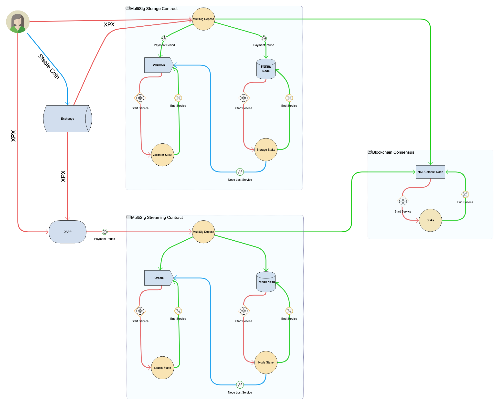
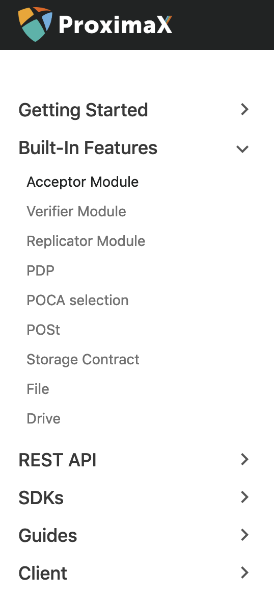

## コア技術開発

チームは今年の目標を達成すべく、開発を推進しています。デザイン観点からのアプローチ、パターンの最適な利用、シグネチャスキームの変更、調査に関してチーム内でディスカッションし、プラットフォームの機能拡張を進めてきました。

### ブロックチェーン　　NEM Cowの統合
テックビューロによって構築されたNEM Techはそのサーバコードのアップグレードを継続しており、特にCow Updateは私達のソースベースへの素晴らしい追加事項となりました。Cow Updateの最も重要な要素は報酬計算の方法と、独特のシグニチャスキームにあります。この報酬計算方法は私達独自のトークンエコノミーの設計方針においても機能確認が完了し、今後私達のインセンティブメカニズムに追加される予定です。

Token Economy High-Level Diagram with XPX and Stablecoin.

### ストレージ/DFMS
2月に最も注力したのは現在のストレージプラットフォームのコードリファクタリングです。 私達のコードとその実行を継続的に改善する調査メンバーと監査メンバーがいます。彼らはコアパターンやその協定における重要な変更後の動作確認を実施しています。この新たな組織編成により、一般のコントリビュータにも使われるようになった際のストレージプラットオームの拡張や構成変更が容易に実施できるようになります。

ドライブ/ディレクトリの機能にも注力しています。この機能によって、ユーザーは事前定義された容量のファイルやフォルダーを保存できるスペースを借りる事ができるようになります。唯一の制限はドライブ数ですが、これは複数のドライブを使うことにより、回避できます。
  
コミュニティ内で共有されるストレージの技術資料も作成を進めています。REST APIやSDKを含む全ての技術仕様、ユーザガイドです。パブリックDFMSはDFMS GO SDKを初めとした独自のSDKがあります。ユーザーやDAPPがストレージレイヤーとコミュニケーションする際に利用し、ストレージネットワーク上でのシンクライアントとしても使うことのできる主なSDKになります。

## ファイルストレージ 権利行使権/ステーキングペーパー
私達はファイルストレージのステーキングペーパーの仕上げを進めています。このドキュメントは公正な経済的インセンティブが働くように導入される出資メカニズムを説明するもので、これらの新しいアップデートを設計概要資料に追加していきます。

ファイルストレージの出資はダイナミックなステーキングスキームをベースにしています。このスキームはストレージのローカルな需要に応じる経済的に公正な出資の形です。ストレージノードとして参加する権利を得るためには、保証デポジットとしてXPXトークンの差額を提供します。この出資・権利行使権を作った目的はストレージノード提供者が最大限可能なサービス品質をプラットフォームユーザーに提供するようインセンティブを効かせる事です。この調査資料はファイルストレージ出資・権利行使権を提供することのメリットの説明をしつつ、どのような交換が最も効果的なのかを考察しています。

詳細に関しては別途発表する資料で提供します。

## テストネットワーク アーリーアクセス プログラム
３月後半から４月前半にかけて、私達のテストネットワークを試してもらうため、開発者向けのアーリーアクセスプログラムを開始し、何人かの開発者、及び企業に対し、このテストネットワーク上でアプリケーションの構築テストを実施してもらう予定です。現時点ではこのプログラムのストラクチャフローを作り、アクセスやSDKs等、この活動を進めるためのサポートシステムの準備を進めています。

## ProximaX　ウェブウォレット アップデート
私達は既にアクセス可能になっているウェブウォレットにおいていくつかの修正を行いました。

アップデート内容は下記の通りです。

1.	Mosaicsの作成、修正に関するサポート
2.	ネームスペースの作成、変更に関するサポート
3.	トランザクションダッシュボードの最適化
4.	トランザクション表示中の動作遅延の修正
5.	トランザクションの詳細タイプの追加
6.	ネームスペースの登録機能
7.	Mosaic 供給の変更
8.	Mosaic 定義
9.	セッション毎のキャッシュ内における Mosaicとネームスペースの一時的な保存
10.	ウォレットUIの変更
11.	モジュール移動の際のモザイク選択機能

テストネットワーク用ウェブウォレットはこちらのリンクからアクセスできます。

http://bctestnetwallet.xpxsirius.io

私達のブロックチェーンの変更に基づき、ウェブウォレットにもアップデートを継続しています。ストレージ及びストリーミングレイヤーに紐付くアプリケーションを提供します。

## ProixmaX エクスプローラー 改良版
私達はVueJsを利用できるようにするため、エクスプローラーを再構築しました。これにより、エクスプローラーのパフォーマンスを改善し、大幅にディストリビューションのサイズを削減しました。また、ユーザーがブロックチェーンエクスプローラーのデータにアクセスする際に直感的なユーザーインターフェイスを利用できるよう改善されました。

私達はこのエクスプローラーをプライベート/許可制 の両方のサービスにおいてバンドルし提供していく予定です。

テストネットワーク用のエクスプローラーはこちらのリンクからアクセスできます。

http://bctestnetexplorer.xpxsirius.io/

## 現在取り組んでいる事項
### 身分確認 PoC
身分確認のPoCに関しても取り組んでいます。APPやデバイスからユーザーが身分確認のプロセスを実施できるようにするための一般的なソリューションです。

身分確認システムPoCは４つのレイヤーがあります。NFC経由, フロントエンド、バックエンド、ProximaX Siriusプラットフォームです。 情報登録とNFC及びProximaX Siriusプラットフォームに保存されたデータ、SDK経由で実施されるオフラインでのデータ確認、機能拡張のためのカスタマイズ可能なフォームを考慮に入れています。

このアプリケーションを説明するライブデモはまもなくリリースされます。

### ワークフロー エンジン
私達は不可変なプロセスフロー状態の保存先としてのProximaX Siriusプラットフォームに支えられたワークフローエンジンについても取り組んでいます。これにより、ProximaX Sirius上にある事前に定義された契約やプラグインのアドバンテージを利用し、高度にカスタマイズ可能なフローを構築する事ができます。 

## サマリー
下記が２月の進捗サマリーです。

* NEM Cow アップデートのProximaX Siriusプラットフォームへの統合
* ストレージ・ストリーミングレイヤーの更なる開発とトークンエコノミーのモデル統合の開始
* ファイルストレージ 権利確定シミュレーションとその調査
* テストネットワークのアーリーアクセスプロブラムの紹介
* 身分確認PoCとワークフローエンジン