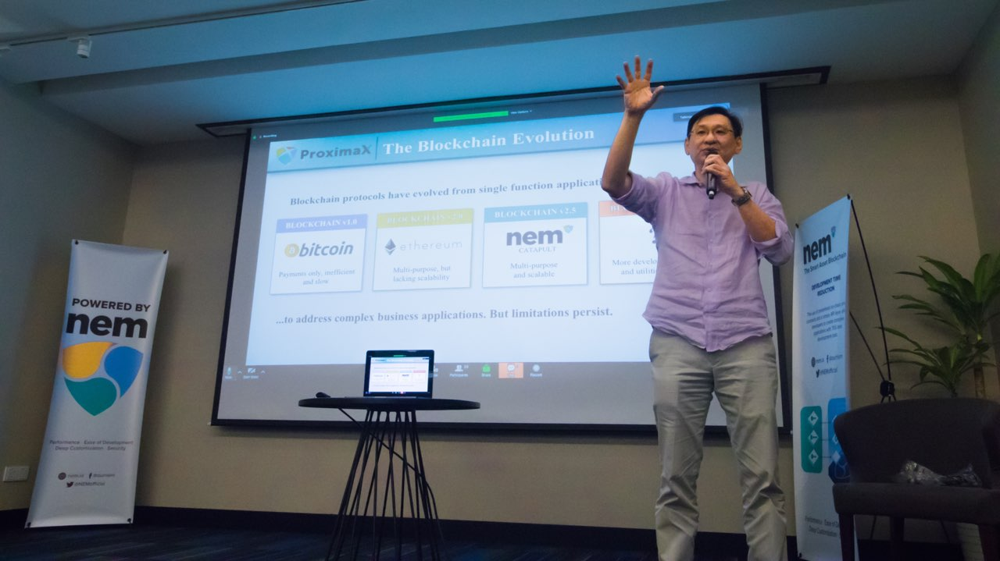
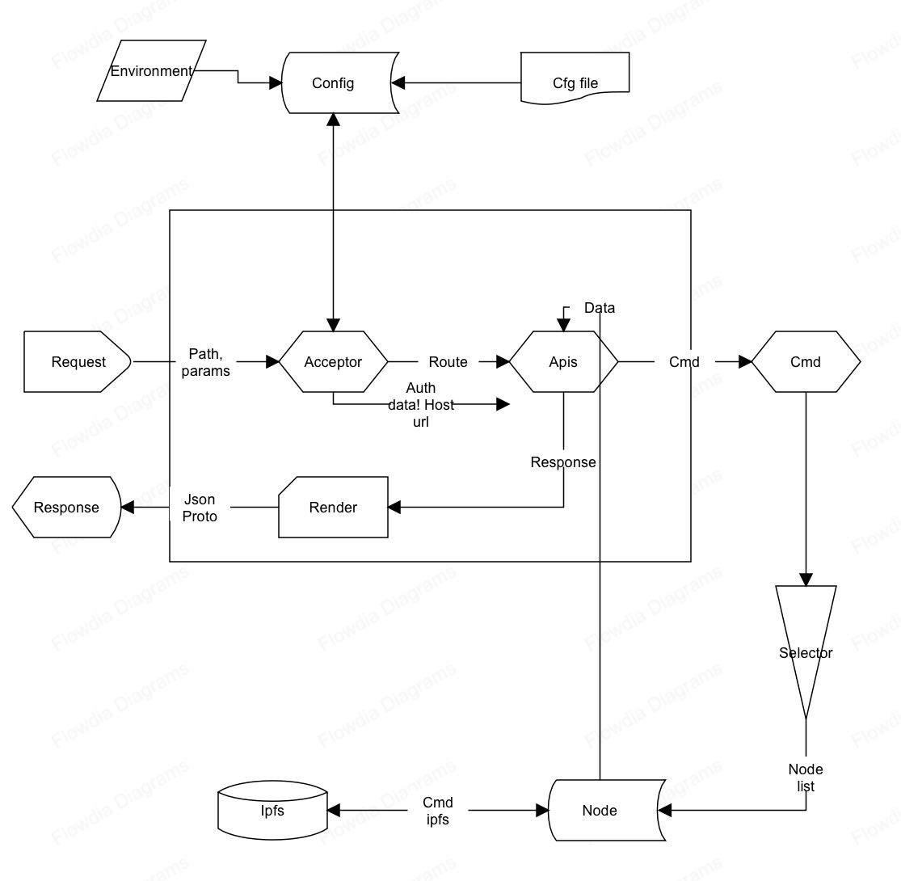
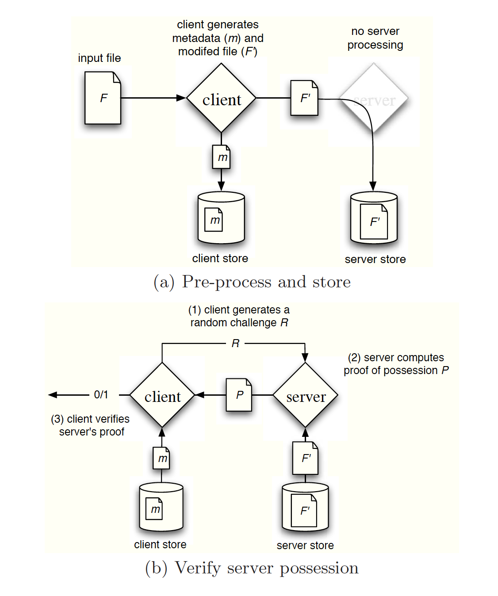
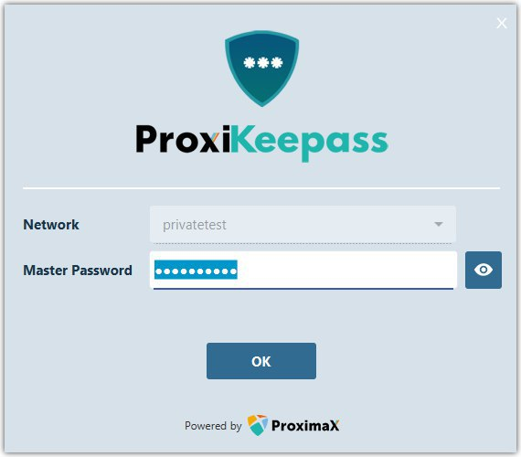
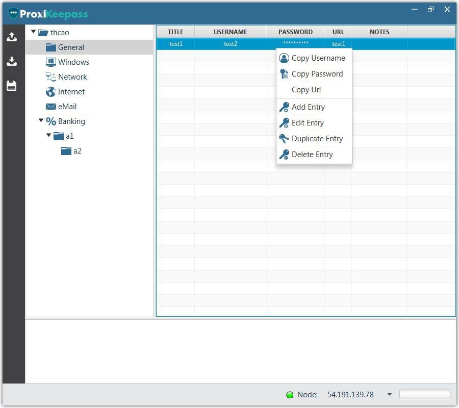
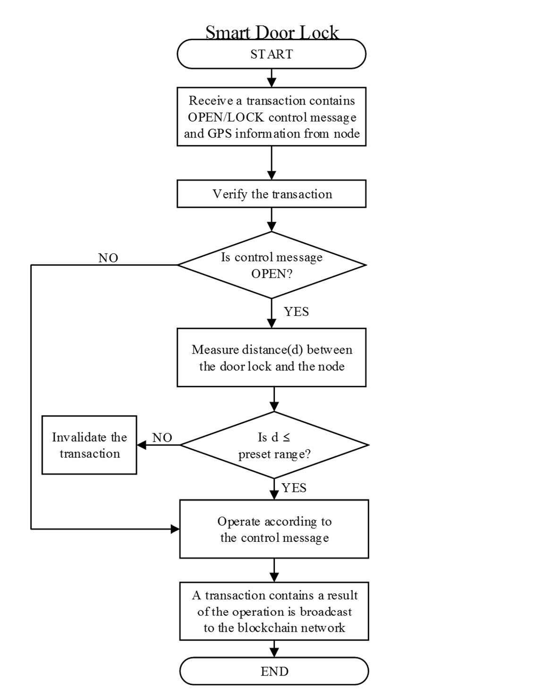
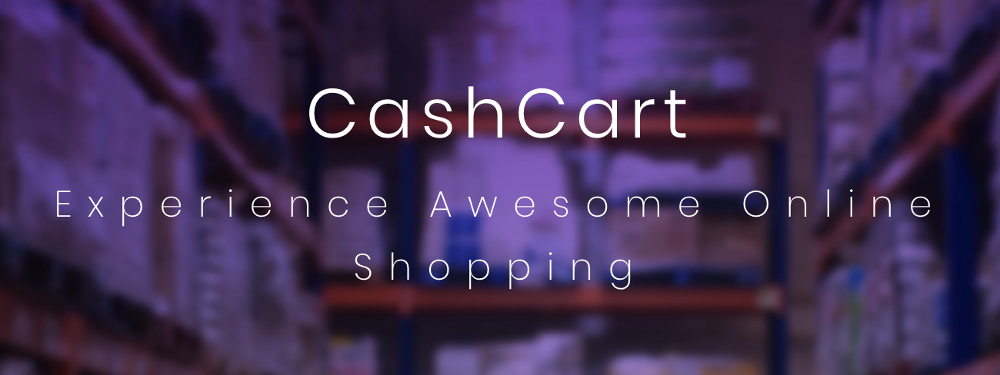

The month of October has gotten a lot more interesting in terms of our technology. Many of the applications that we are building are now in the final stage of testing.

## Tech/Developer Meetup
We had our first developer meetup in early October where Lon and I discussed the benefits of the ProximaX platform and how it can make an enormous impact on business processes. Lon outlined the several critical components of the ProximaX platform offering, and I did a high-level component overview of ProximaX, the development status as well as upcoming updates.

Presentation slides in PDF: 
* [ProximaX Overview](https://ipfs.io/ipfs/QmapKy64pU9CkyyGWxKSTL9yhPfS5CUxdYrpWgoEXAvVxF/20181012%20NBC.pdf)
* [ProximaX Technology Stack Overview](https://ipfs.io/ipfs/QmcGx7tWF3fGNrwkQQVR3Y6AoMGER9MxSo5y2qUbMnQVWr/Technical%20PPT.pdf)

## Core Development Updates

### ProximaX Sirius Blockchain
I'm proud to announce that we are well on our way to provisioning our TESTNET Blockchain network. The entire team has been pushing the core changes, and we are on the final stretch of patching Catapult's core. Our plan encompasses provisioning five blockchain TESTNET nodes which will be open to the public along with other tools. The blockchain TESTNET nodes will be our staging grounds for testing catapult changes. We will incrementally increase the number of nodes as we finalize these changes. We will create another announcement specifically for our Testnet. Every release we do moving forward will be documented and announced for transparency.

With NEM's Catapult, we can create a separation of our changes to theirs, and with the plugin mechanism, we can extend new transaction types specific to ProximaX which will be crucial to the overall system. 

### Acceptor to PDP/PoREP
We have put our efforts into building the acceptor, Proof of Data Possession (`PDP`) and Proof of Replication (`PoREP`) implementation and this is now under testing. The Acceptor is the main component that catches upload requests that are in turn fed into the node. The selected node then goes through the process of verification and an on-going challenging mechanism to make a proof of data possession.

A **Proof of Data Possession** scheme allows a client that has stored data at an untrusted server to verify that the server possesses the original data without retrieving it or storing a copy himself. It accomplishes this by generating probabilistic proofs using an interactive protocol with the remote server. 

When the server answers the challenge/proofs, it is a mandatory process and failure to do so represents a data loss, this will affect the host's reputation and be given a lower chance of accommodating the request from the clients. Despite these though, the server can still trick the system by convincing the verifier that it still possesses the file. The server’s motivation for misbehavior can be diverse and includes reclaiming storage by discarding data that has not been or is rarely accessed (for monetary reasons), or hiding a data loss incident (due to management errors, hardware failure, compromise by outside or inside attacks, etc). 

The goal of a PDP scheme that achieves probabilistic proof of data possession is to detect server misbehavior when the server has deleted a fraction of the file. There are several approaches we're doing as to how we are handling such misbehavior which we will have extensive coverage in one of our technical paper that we will publish soon.

**"Proof of Replication"** is mostly the same but the challenge will consist of a prover defending a publicly verifiable claim that it is dedicating unique resources to storing one or more retrievable replicas of a data file. Viewing it from a birdseye view, when the client wants to have a file replicated, by initiating a replication request (which is enabled by default), it chooses a host and a set of verifiers (`%` of network within the vicinity), the verifiers are the ones who challenge the replicators (provers) if they hold the file using a challenge set that needs to be solved in a given time frame. There are several attributes here that actually is similar to PDP but the difference is `PoRep` is a combination of `Proof of Retrievability` and a `Proof of Space`. These 2 proofs need to be satisfied for a node to prove that it does have the file.

These two concepts are just one of the consensus algorithm we are building on the storage layer of ProximaX as a way to manage proofs between host and replicators, verified by the system verifiers (which are other nodes as well). A more extensive write up of this will be available on our consensus technical white paper.

### Key Concept: Storage Lifecycle
We've finalized and completed the initial implementation of our storage onboarding, and we have defined the following to understand the lifecycle of a storage node. There will be extensive coverage of this in another blog post and on our technical whitepaper but below is a summary of the process.

**Start: Storage Node Onboarding**

When a user wants to participate by contributing disk space, the user first needs to participate in the network. Several steps need to happen before successful participation is achieved.

A storage contributor needs to run a CLI that will then evaluate the storage and disk space. Information will be collected and sent to the network for verification. The closest verifier then challenges the node to prove that it has the amount of space. The protocol is based on a puzzle over hard-to-pebble graphs. Once verified, the node can use a storage mosaic asset which will be registered on the POCA-Market selection.

* Node allocates some space on disk to be used as storage and submits to the network request for verification.
* Verifier runs interactive protocol, which requires a node to prove the ability to use such amount of space.  A protocol is based on the puzzle over hard-to-pebble graphs.
* If storage passes this protocol, a node can use a storage mosaic asset in POCA-Market for storage.

**Working: Processing client requests**

After a storage node is onboarded, it can now then process client requests. The node then publishes its price per GB or agrees on system-wide pricing set by ProximaX. After the revenue model is set, it will be included as part of the participant list that is part of the market selection process. When the node becomes a participant, it will have a reputation that can change depending on numerous factors, such as stakes, available storage, bandwidth, competitive pricing, and reported verifier stats.

* Node publishes their price per Gb or agrees on system-wide pricing set by ProximaX.
* After this, it can participate in a market and be selected as a storage provider or verifier of other nodes, according to storage contract, which will be described in the next chapter.
* During such work, storage node can receive and lose reputation, which is used as a parameter to determinate a priority of suppliers.

**End: Ending of the node lifecycle.**

When a node goes offline, it can pass its duties to other nodes. Nodes can then pass a current contract to another node which can continue the work of the off-boarded node.

* A node can just stop announcing itself as a storage provider and pass duties in a current contract to another node. 

### Reputation: PoCA Market/Selection
The entire node ecosystem of ProximaX runs on different networks but all actors within it have a reputation. After months of design and discussions, we're now ready to build this system. Reputation is used by a selection mechanism: an agent with lower reputation stands a lower chance of being selected. Reputation with vesting gives us a mechanism, which makes it optimal for users to have an identity and care not to be excluded from group consensus.

When a specific client requests a service (storage), the node starting point runs a decentralized auction on market by detecting the next best node to accommodate the request.

Each node maintains a market-table for each type of service where it has:
* account address, and an associated node
* node endpoint that provides a service
* amount of service provided (GB for file storage, verification of space check, content auction and auditing etc)
* Price Marks
* Location
* Reputation (previous statistics if any)
* Node Stake - we will have more details on `staking` soon.

These are all run in a complex algorithm of handshakes and reconciliation between a specific buyer (service consumer) and a seller (service provider).

### Blockchain SDKs
We have reported to the public that we are contributing to Catapult by building the SDKs for specific platforms. We've since published this and we intend to continue with it. In October we released "Go" and "Swift" SDK. We are also building Python and possibly looking at building Ruby and Rust SDKs.

* https://github.com/proximax-storage/nem2-sdk-go
* https://github.com/proximax-storage/nem2-sdk-swift

Python SDK is still under development and we are collaborating with NEM Foundation to build it.

### White/Technical Paper and Roadmap Updates
We now have a few technical papers lined up, which are now being reviewed and proofread. These papers will have the technical details of each of the components. We will release this to the public as soon as it's done.

Given the changes we've had, we have decided to update our roadmap. Of course, we owe it to the public to show our high-level path to success. The roadmap will be shown along with the new updates to the site which will come soon. We are now in the process of our website revamp.

## Application Development Updates

### ProxiBox, Notes and Keepass
ProxiBox, Notes, and Vault are now in its final stage of development/testing. ProxiBox will be renamed ProximaX File It! and Keepass will be known as ProximaX Vault. We are currently building the revenue and licensing model that will, in turn, be used to commercialize the products. The internal team is now doing all the necessary tests to ensure that all core functions are working. File it!, Notes, and Vault will be compatible with Windows, MacOS and Linux-based System. 

Next update:
* To build marketing campaigns.
* To incorporate the licensing mechanism we are building and introduce the revenue model.

### ProximaX Suite
Our office suite is based on NextCloud/OnlyOffice. ProximaX Suite is a complete end-to-end office application that sits on top of the cloud, backed by our secured infrastructure service of Catapult and DFMS.

You can now register and experience ProximaX Suite at:

https://suite.proximax.io

This version only allows for 20 concurrent users at a time.

Next update:
* Launch playground site for ProximaX Suite.
* Marketing campaign to spread the word about the application.
* Explore opportunities of commercialization.
* Inclusion of our commercial offering.

### Notable Updates and what's on the pipe
Here are some of the notable updates we have on application development branch.

* ProximaX Desktop Wallet with Apostille, File Manager and Voting Modules
* ProximaX Blockchain Explorer
* ProximaX Apostille (ProxiNotary)
* ProximaX ERP -expect a long development cycle

These are just some of the applications we are working on and our team will give an update on these soon.

## Technology Partnership and IoT Project
We've been working with 482 solutions to build the core and we intend to build a strong relationship with them. Aside from them helping us to build the platform, we've also been having preliminary discussions on building an IoT project. We will share details of this as soon as we get some traction on it but in a nutshell, the idea is a smart door lock system that's based on ProximaX Sirius blockchain. 

## Developing Solutions. Providing Support.
Our excellent team is providing solutions and support for the following customers:

### CashCart
CashCart availed our ProximaX Sirius Private Blockchain Instance and they are now using it on their Enterprise online shopping platform that has its own trustless and decentralized rewards system. We have built a solid relationship with them by signing an MoA that gives us a solid footing of ProximaX awareness and adoption in the Philippines.

With CashCart's cooperation, we will be able to spread more awareness of ProximaX Technology in the Philippines. They’ll be conducting ProximaX technical training via their extensive coaching academy to help people learn the technology behind ProximaX and build communities to expand our brand across the Philippines.

### Omniaz
Omniaz, like CashCart, will be availing our ProximaX Sirius blockchain instance to handle millions of SKUs. We have built a highly customized instance for them to ensure that it can handle the number of entries and transactions they need to accommodate the millions of SKUs they're putting into the system.

## In Summary

In October, we are pleased that much of the core development has been progressing well. We have started to build the code to support the storage mechanism, PoS Blockchain changes and Proof of Bandwidth approach for live streaming.

Below is a summary of what we've done for October:

* Catapult SDKs Go and Swift
* PDP, PoRep and Storage Components Implementation
* Storage Lifecycle
* ProximaX Sirius PoS Peer Review and blockchain TESTNET launch preparation
* Developing Solutions for Customers
* Start of exploring potential IoT project opportunities
