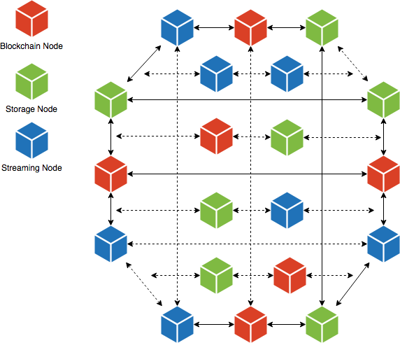
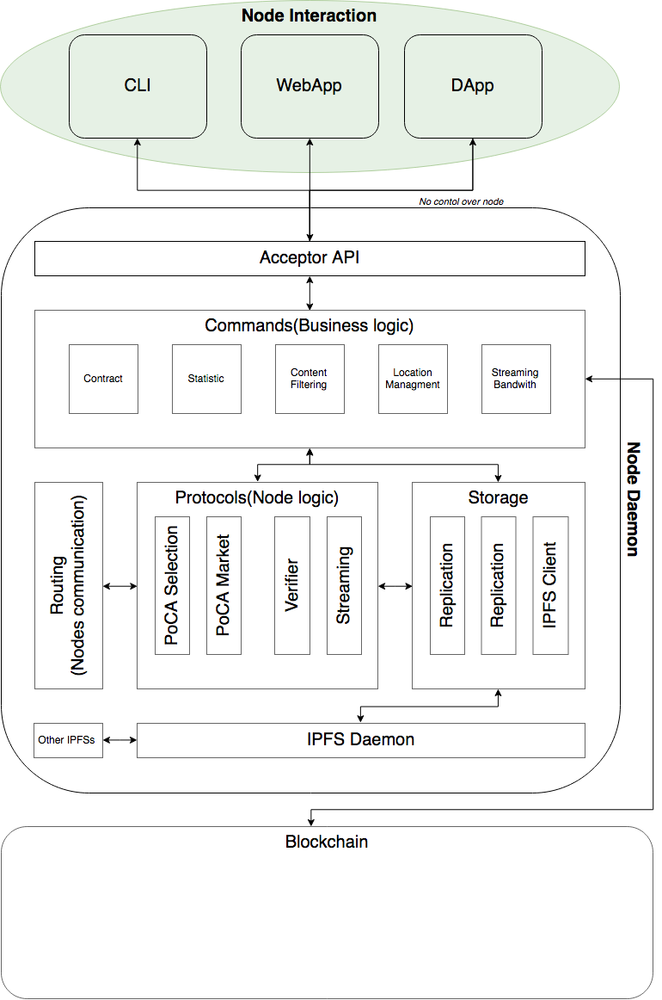
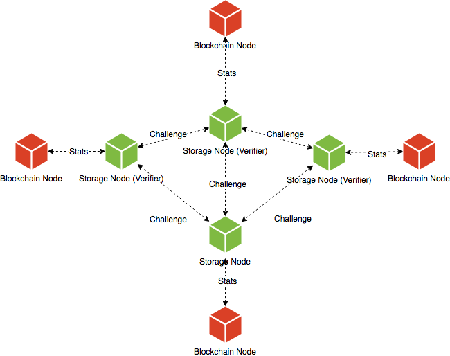
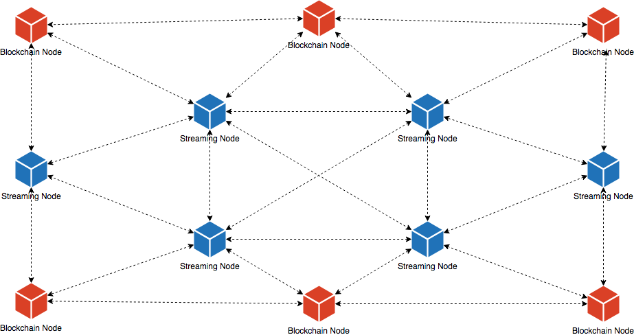
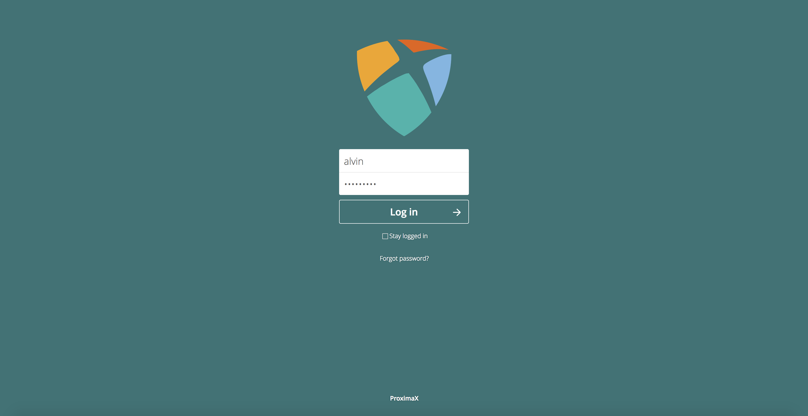
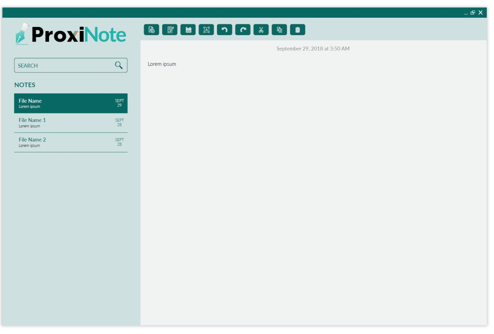
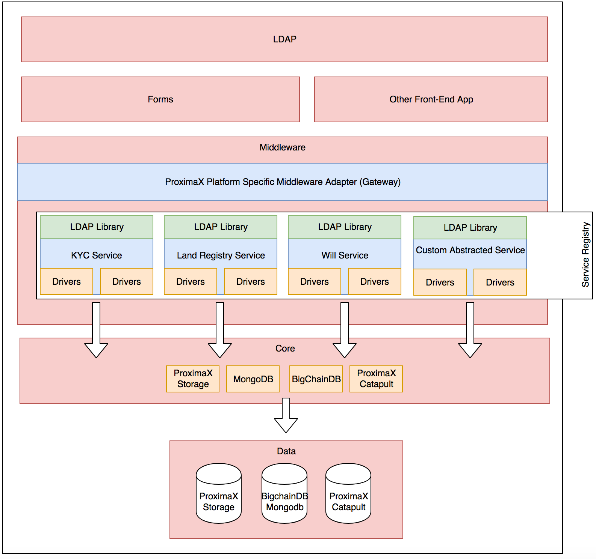
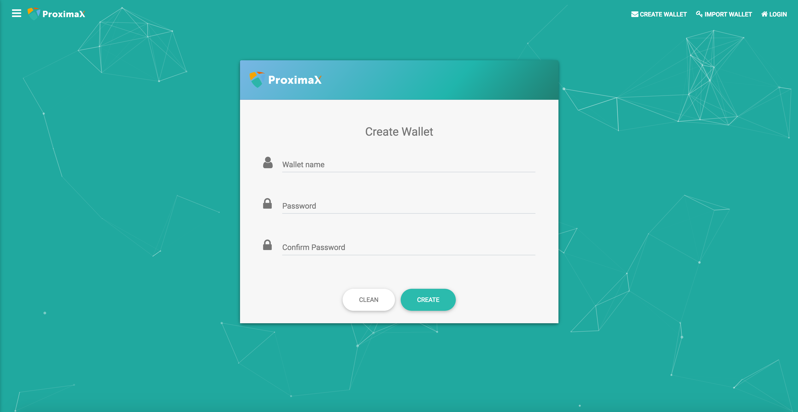

The month of September had all of us focused on finalizing most of our applications as well as our core platform research. Most of our applications are either in UAT or Pre-Production Stage. Our core platform research has been ongoing, parallel with the development of its respective modules. 

In this post update, I'll be giving some brief updates on what we've been doing during the month of September and some key updates on the platform and apps.

## Core Platform - Development Status
Our research has mostly focused on solidifying the approach, including the set of actors, modules, data flow, the token, and consensus. The scope of these all is just too big to fit into a single blog post so I will dedicate an entire post to share the high-level design, consensus schematics and a white paper on a separate update hopefully within the month of October.

### ProximaX Platform - Sirius
The codename for this platform that we are rolling out is called **Sirius**. Sirius is taken from the top ten brightest stars in our galaxy which clearly represents what we want to achieve; the initial rollout of what will define ProximaX that will shine the brightest of them all. 

The ecosystem of ProximaX revolves around the network **actors** we have. These actors are the nodes that work together to achieve the platform services that it'll offer.

Below is a description of each of the actors in the network ecosystem actors.

#### Blockchain nodes 
With Catapult, we have a powerful blockchain. Catapult is currently a private version and its consensus mechanism is not optimised for public deployment. Consequently, we are implementing a consensus mechanism that references to NXT's implementation. The blockchain nodes will be primarily used as a recording ledger of all transactions across the ecosystem. It includes node information, statistics, configuration, and functional data, incentives, transaction, and contracts. Our ecosystem data flow rests entirely on the blockchain nodes. NEM's Catapult Technology suits this best.

With NEM's Catapult, we'll be able to take advantage of its pre-defined/built-in smart business rules and logic, and plugin mechanism. We're going to use it to store proof statistics and reputation inputs, and our very own Proof of Conflation Aggregate Selection and Market. In September, we built the design on how each Catapult feature can be used to support our ecosystem of storage and streaming nodes. 

The Sirius initial rollout will only be the Catapult nodes since this will be our main ledger technology that powers all succeeding nodes and services. Hence, a testnet will be rolled out shortly. We will need some public participation and we are hopeful that the community will watch out for this announcement and contribute to testing the network.

#### Storage nodes - Host, Verifiers, Replicators
Storage contributors will be different from blockchain nodes. These nodes will primarily be the focal point of our vision for decentralized storage. These nodes will have an onboarding mechanism that will enable them to participate in the network and set their revenue model according to their preference. Once on board, they will be included in the marketplace on their storage availablilty which will then be exposed to different consumers. 

Storage nodes will be verified, tested and challenged. Each storage node will have its own reputation based on the collection of Proof we get from them. We use several mechanisms for this including Proof of Data Possession, Space/Time, Replication, and Bandwidth to ensure the consistency of reputable nodes on the network.

Verifiers and replicators are storage nodes too. Once a storage node is in the network, it will periodically be challenged by a set of verifiers. The output from these verifiers will then be fed into the reputation system we're building which will form the basis of the selection process. Replicators, on the other hand, are a set of randomly selected nodes that agree to be a replicator of files. Like storage nodes, these will be challenged and verified, too, but not with the same frequency as the actual host of the files.

#### Streaming nodes
All streaming nodes are organized into a loosely connected mesh network where some of the nodes are connected with neighboring nodes. Nodes are designed to maintain internode connections when required and drop unused connections and re-establish when required again. Some streaming nodes will be publicly accessible for ProximaX DApps via one or several public network interfaces, where some streaming nodes will serve as internal nodes only, and will be used for interim hops in the system.

The team is mostly working on finalizing the onion-routed piece of the protocol which is primarily the client presence announcement, that entities within the streaming ecosystem will use to look up and secure private messaging. Development of nodes and Client/SDK is in progress, and work has started on the building of the audio/video streaming piece. Similar to storage, we've also started to build the blockchain integration which we will continue until the month of October.

### Executor Nodes - Super Contracts
The fourth actor shall be the executor nodes that can also be a storage node. Towards the end of September, the team started some preliminary discussions and research on how to extend and implement a Smart Contract solution that is entirely different in approach from current Smart Contract solutions, which are somewhat prohibitive to be implemented in a practical manner. We shall term this augmented and amended version of the Smart Contract, **"Super Contract"** so as to differentiate ourselves from existing Smart Contract projects. This will likely not go into the first version of ProximaX and will likely be part of the next iteration.

Once this is implemented, it will open a huge opportunity for application developers to use the platform for their decentralized solutions application solutions. We will be introducing container managed technologies as well as potentially build our own scripting language to allow developers to build distributed executable codes, using a Distributed File Management System ("DFMS") that are executed by the executor nodes.

It is still very early but we have compelling research papers and our experts have experience in building such technology stacks. We will do our best to give more information on this in the upcoming months once we are settled with our core offerings.

### Proof of Conflation Aggregate Selection and Market
One new concept we are introducing is the PoCA Market Selection. It's basically an auction system that will be used by the network to determine the best nodes that can accommodate the given request. It incorporates all statistics including reputation score based on Proof of X, Market Pricing, location etc, all of which are used to determine the best nodes available for a given job.

We have finalized the design and parameters that are needed for PoCA and have started to build some of the components needed for this module. We aim to give a more technical, in-depth document by the end of the month.

### Token Economic Fit on Storage and Simulation
We are fortunate to have researchers that are thorough in analyzing our requirements and incorporating the vision we have in using the token as part of the ProximaX ecosystem. As mentioned in last month's update, we were looking to use a stable token that will represent the "power" for ProximaX.

For every client request, tokens are needed. When the user demands a service, the client application shall accept tokens for service and assign to winners of the auction as locked tokens. If the service was implemented properly the token shall be unlocked and distributed between verifiers and storage nodes according to an agreement. 

If an issue arises during the course of servicing, thereby nullifying the service with the first provider, a verifier shall award the locked token to another storage node. It provides for a new auction and assigns the locked tokens (or part of it) to another storage node. This method of reassignment provides for continuity of a paid service. A set of criteria shall be used to determine whether or not a storage node can fulfil its obligation. This model will need to be well defined and sound so that we do not end up with the problem of wrongfully penalising a node for non-performance.

Upstream, the auction to win the provisioning of the service must also be designed against any malicious behaviour. To that end, verifiers will carry out tests to ensure that a consensus is reached whereby storage nodes does not cheat or appear to be able to provide the service when they cannot.

We have an initial simulation of this distribution of tokens to actors given a business use case and we hope to give more information on that in the upcoming months.

## Application Development
Most of the applications we've been developing are functionally done but almost all of them are being transitioned from NIS1 version to Catapult. Below, are some of the following key updates we have.

### ProxiDocs to ProxiSuite
ProxiSuite is an office application based on NextCloud, OnlyOffice, and  integrated with ProximaX technology. The office suite is fully capable of supporting real-time document management based on Microsoft / Open Office document files. The OnlyOffice extension backed by Proximax technology allows users to create and manage their documents using the decentralized storage and blockchain encryption mechanism. We may decide to rename ProxiSuite at a later date via a competition once there is clarity on the functions of the application.

We'll launch a public version of this soon.

### ProxiBox UI enhancements and Testing
We've been working to improve the UI and migrate the library over to Catapult. We're now working to establish the revenue model. Eventually, this will be folded into the ProxiSuite

Dark ProxiBox Theme

Light ProxiBox Theme

### From Pad to ProxiNote 
ProxiNote is another utility tool we're building. This will allow users to fully encrypt and secure their notes.

The long term plan is to build a Web UI for this, and again, may be absorbed into ProxySuite. This is a simpler version of Evernote but with a powerful blockchain level encryption.

### ProxiForms - Framework and Middleware
ProxiForm is an application development and business tool framework to allow its users to build form-based applications backed by blockchain. This is a huge project to build a form-based framework backed by decentralized technologies such as Catapult and BigChainDB. The end result is, once implemented, it will provide us with a tool to build some simple forms like survey forms to complex and complicated workflow processes, utilising the Catapult multi-aggregate signatures.

As it stands, we are in the middle of evaluating the technology stack for this framework. The most compelling feature of proxiform is the middleware stack

## Ongoing Contribution Projects
ProximaX, as a company, is also contributing to the Catapult/NEM project. Below are some of the projects we are building as a contribution to NEM.

### Catapult Desktop Wallet
We're building a ProximaX Catapult desktop wallet that can be used to manage our coins, in particular, the XPX coins. This is now ongoing and we have a few screens to show its progress.

Once done, we will contribute this to the public, so that everyone can use our powerful desktop wallet and extend its functionalities for their own use.

The desktop wallet is not your typical wallet. We are building a framework and SDK service on top of it so that anyone can extend and use it for their own set of applications. Anyone can develop using our plugin framework on typescript/javascript and customize the wallet.

### Catapult SDKs
We're building 3 Catapult SDKs as our contribution to NEM Foundation technology, written in Golang, Python and Swift 4.

This essentially means that once this is released, platform developers will be able to use the SDK to build their powerful applications on top of the Catapult blockchain. 

We'll be opening these SDKs to the public soon.

https://github.com/proximax-storage/nem2-sdk-swift
https://github.com/proximax-storage/nem2-sdk-python
https://github.com/proximax-storage/nem2-sdk-go

## Wrapping up September
In September, we are extremely happy that much of the core development has been progressing well. We have started building some design components pertinent to the overall ProximaX platform, as we have almost firmed up the development architecture.

Below is a summary of what we've done for September:

* Storage SDK Java, Typescript/Javascript is 90% complete. Most of our applications right now are migrating from the use of NIS1 SDK to the new Storage SDK.
* PoC of Consensus Algorithms.
* Node Onboarding Process
* Building of Reputation System for Storage Nodes
* Continue building the Storage Layer Components
* Continue building the Streaming Layer Components
